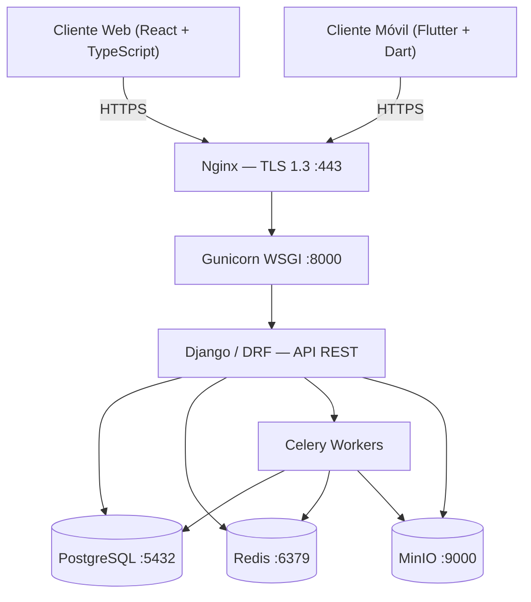
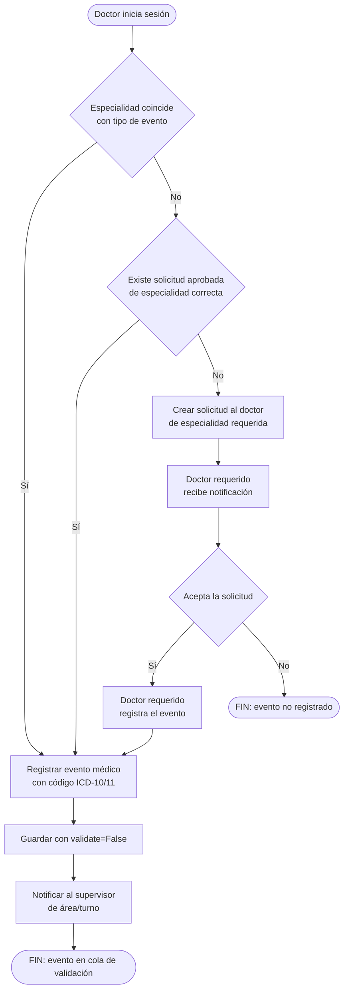
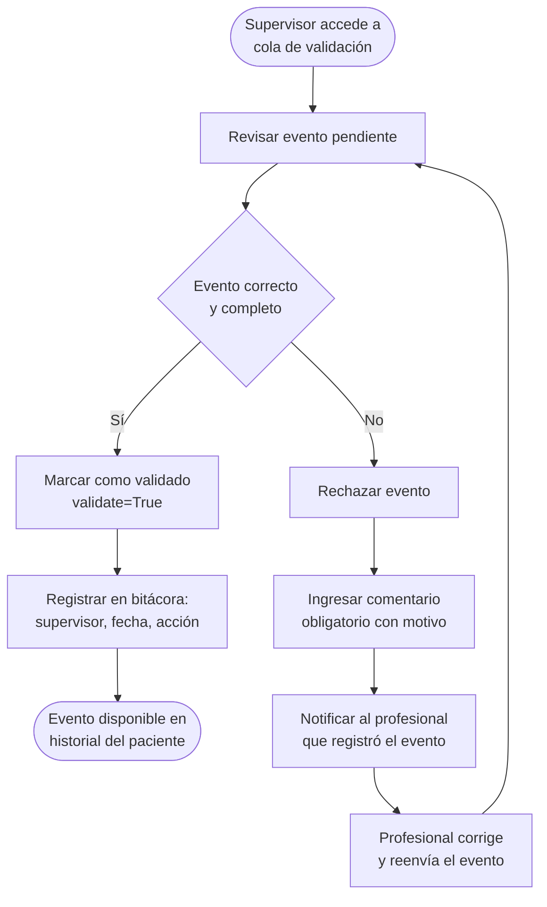
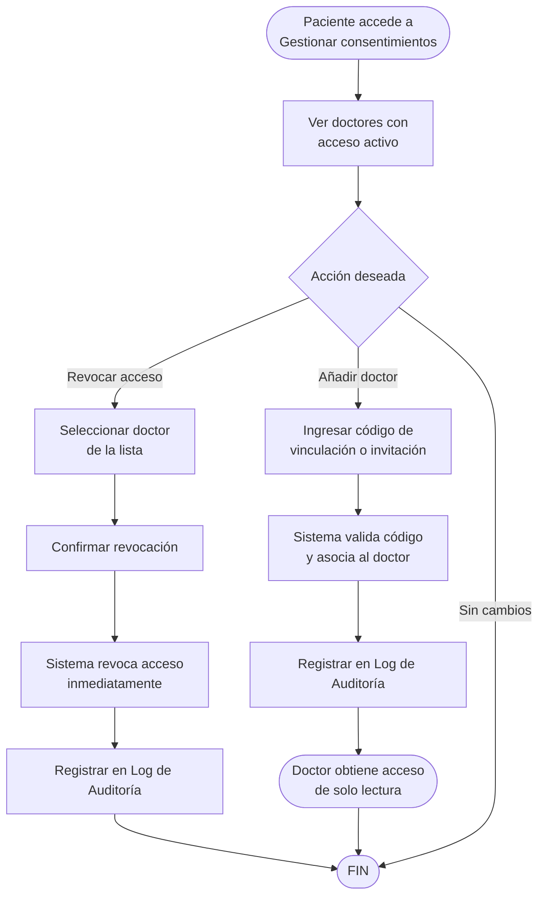
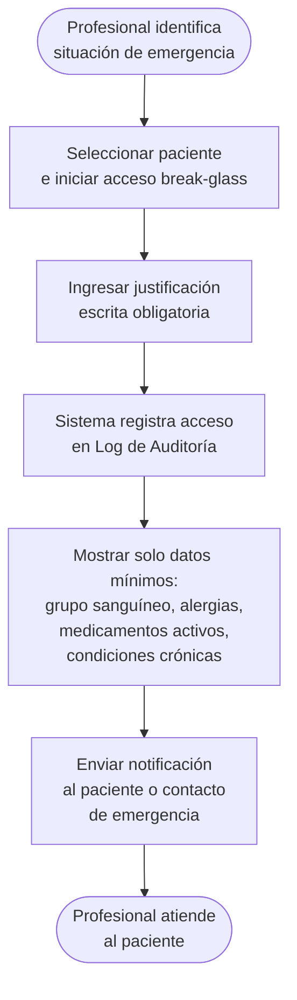
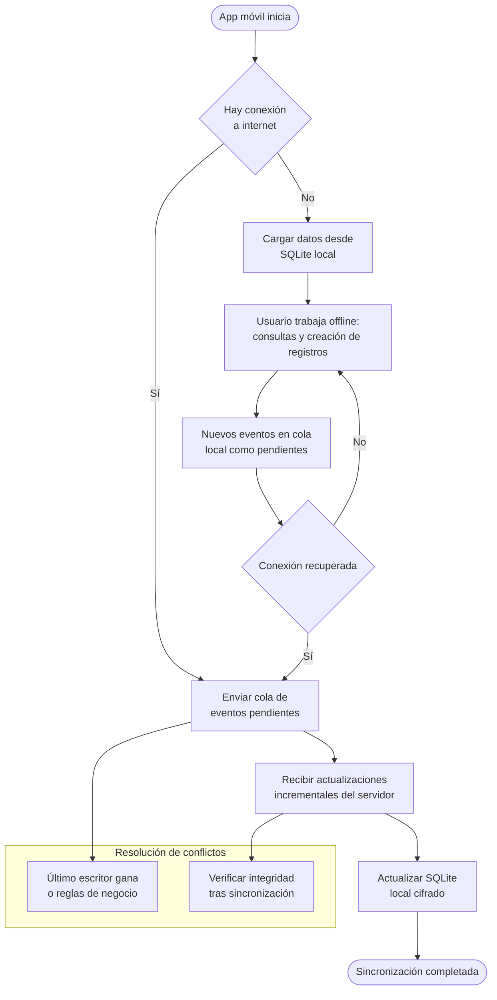
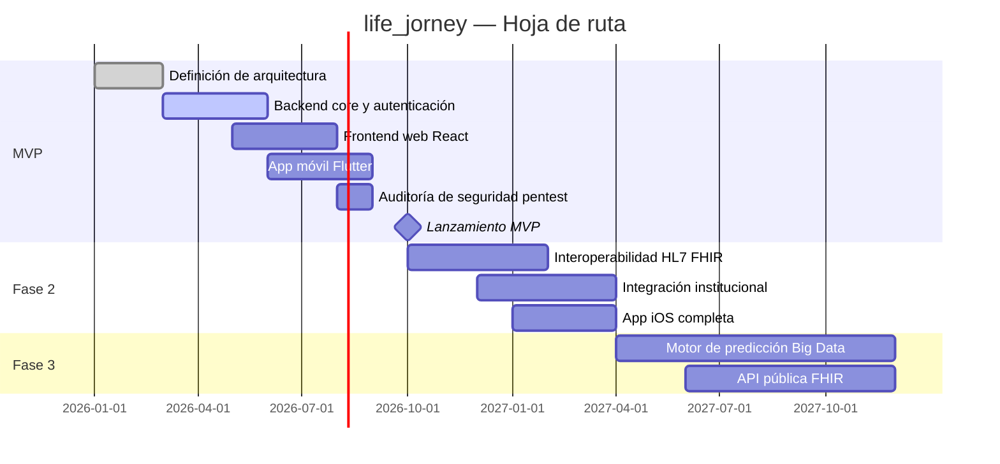

# INGENIERÍA DE SOFTWARE — life_jorney

> Documento vivo. Se actualiza progresivamente conforme se define el producto.

---

## Índice

1. [Visión del Producto](#1-visión-del-producto)
2. [Historias de Usuario (HU)](#2-historias-de-usuario-hu)
3. [Requisitos Funcionales (RF)](#3-requisitos-funcionales-rf)
4. [Requisitos No Funcionales (RNF)](#4-requisitos-no-funcionales-rnf)
5. [Arquitectura de Software](#5-arquitectura-de-software)
6. [Diagramas de Procesos](#6-diagramas-de-procesos)
7. [Diseño de Interfaces (UI)](#7-diseño-de-interfaces-ui)
8. [Patrones de Diseño](#8-patrones-de-diseño)
9. [Interoperabilidad y Estándares Clínicos](#9-interoperabilidad-y-estándares-clínicos)
10. [Privacidad por Diseño](#10-privacidad-por-diseño)
11. [Modelo de Sostenibilidad](#11-modelo-de-sostenibilidad)

---

## 1. Visión del Producto

life_jorney es la plataforma global, abierta y sin ánimo de lucro que concentra, protege y —en el futuro— analiza el historial médico completo de una persona, desde antes de nacer hasta el final de su vida, con el fin de predecir enfermedades antes de que ocurran.

### 1.1 Propósito y problema

Hoy, la información médica de una persona está fragmentada en decenas de sistemas, hospitales y formatos. No existe un lugar único, seguro y universal donde pacientes y personal de salud puedan consultar el viaje clínico completo de un individuo, incluyendo antecedentes familiares que permitan estudiar patrones hereditarios.

life_jorney resuelve esa dispersión y sienta las bases para, en fases posteriores, aplicar algoritmos masivos de Big Data que calculen la probabilidad de desarrollar enfermedades como el cáncer a partir de esos datos.

### 1.2 Usuarios objetivo

- **Pacientes:** personas que desean tener el control y la propiedad de su historial médico unificado, y el de sus familiares directos (padres, abuelos, etc.).
- **Personal de salud:** médicos, enfermeros, especialistas, técnicos de laboratorio, profesionales de imaginología y centros sanitarios que necesitan consultar o registrar información clínica de forma segura, con el consentimiento adecuado.
- **Centros de salud:** hospitales, clínicas y consultorios que deseen integrar sus sistemas con life_jorney como repositorio de historial unificado.
- **Futuro (no en MVP):** investigadores y sistemas de IA cuya finalidad es generar predicciones de enfermedades hereditarias sobre datos anonimizados.

### 1.3 Propuesta de valor única

- **Concentración total:** un único repositorio con todos los eventos médicos del paciente —consultas, vacunas, diagnósticos, tratamientos, informes prenatales— desde antes de su nacimiento hasta la causa de fallecimiento.
- **Seguridad y privacidad como base:** los datos son sensibles; la protección, el consentimiento informado, la privacidad por diseño y el cumplimiento normativo (GDPR / HIPAA) son un pilar fundamental, no un añadido.
- **Interoperabilidad clínica:** los datos se almacenan y pueden exportarse usando estándares internacionales (HL7 FHIR R4, ICD-10/11, LOINC, SNOMED CT).
- **Acceso de emergencia controlado:** mecanismo break-glass para situaciones críticas donde el paciente no puede otorgar consentimiento, siempre auditado y notificado.
- **Predicción de enfermedades:** en fases posteriores, un motor de Big Data analizará patrones familiares para anticipar riesgos hereditarios, operando exclusivamente sobre datos anonimizados o con consentimiento explícito para investigación.
- **Alcance global:** disponible 24/7 en cualquier ubicación, con acceso desde web y dispositivos móviles.

### 1.4 Alcance inicial (MVP)

**Lo que incluye:**
- Registro cronológico de todos los eventos médicos del paciente (nacimiento, consultas, vacunas, diagnósticos, tratamientos).
- Gestión de alergias conocidas y medicamentos activos del paciente, con alertas de interacciones.
- Registro de antecedentes familiares (padres, abuelos, otros familiares).
- Roles de acceso diferenciados con autenticación segura y doble factor.
- Trazabilidad y control de quién accede a la información (log de auditoría inmutable).
- Acceso de emergencia (break-glass) con notificación automática al paciente.
- Exportación del historial en formato HL7 FHIR R4 y PDF.
- Derecho al olvido: eliminación permanente de cuenta y datos personales.

**Lo que queda fuera de la primera versión:**
- El módulo de Big Data y predicción de enfermedades.
- Capacidades avanzadas de estudio de patrones hereditarios.
- Integración directa con sistemas HIS/LIS hospitalarios mediante FHIR.

### 1.5 Contexto de uso y plataforma

- **Disponibilidad:** a cualquier hora del día, todos los días del año.
- **Plataformas:** Móvil (Android/iOS en Flutter/Dart), Web (React).
- **Backend/API:** Python/Django con Django Rest Framework (DRF).
- **Alcance geográfico:** global.

### 1.6 Significado del nombre

life_jorney representa simbólicamente el viaje de la vida del paciente: un recorrido único, irrepetible, que merece ser documentado con dignidad y precisión. La alteración gráfica de "journey" por "jorney" le da una identidad propia, evocando que cada historia clínica es también una historia personal.

### 1.7 Filosofía y modelo de comunidad

life_jorney nace como un proyecto open source sin ánimo de lucro, impulsado por una convicción profunda: como humanidad, invertimos y desarrollamos mucho más para las guerras que en materia de salud. Este proyecto es un pequeño acto de rebeldía contra esa realidad.

Creemos que una herramienta tan esencial como el historial médico unificado y la predicción temprana de enfermedades debe ser un bien común, no un privilegio comercial. Por eso:

- Todo el código fuente estará disponible públicamente bajo una licencia open source permisiva.
- Cualquier persona —desarrolladores, médicos, diseñadores, investigadores— puede contribuir, auditar, mejorar y extender la plataforma.
- La gobernanza del proyecto fomentará la colaboración transparente, las decisiones colectivas y el respeto por los datos de los pacientes como un derecho humano.
- Se alentará a que instituciones de salud, universidades y ONGs se sumen para enriquecer el ecosistema con su conocimiento clínico y técnico.

**¿Cómo sumarte?** Si compartes la visión de que la tecnología sanitaria puede salvar vidas cuando se comparte libremente, eres bienvenido. No importa si tu aporte es código, diseño, documentación, revisión médica o difusión.

---

## 2. Historias de Usuario (HU)

| ID | Historia | Criterios de Aceptación | Prioridad |
|----|----------|------------------------|-----------|
| HU-01 | **Registro de evento médico por especialidad** Como doctor, quiero registrar un evento médico a un paciente (consulta, diagnóstico, vacuna, etc.), siempre que corresponda a mi especialidad, para construir un historial clínico completo y fiable. | - El sistema verifica que el doctor tiene la especialidad requerida para el tipo de evento. - Si no coincide, el sistema bloquea el registro salvo que exista solicitud aprobada (ver HU-02). - El evento se guarda con `validate=False` hasta que un supervisor lo apruebe. - Se registran automáticamente autor, fecha y hora. - El diagnóstico se codifica con ICD-10/11 obligatoriamente. | Crítica |
| HU-02 | **Solicitud de registro entre especialidades** Como doctor, quiero solicitar a otro doctor de especialidad diferente que registre un evento en el historial de un paciente, para asegurar que cada dato sea introducido por el profesional adecuado. | - El doctor crea una solicitud dirigida a un doctor de la especialidad requerida, indicando paciente y tipo de evento. - El doctor solicitado recibe notificación y puede aceptar o rechazar. - Si acepta, registra el evento y este queda vinculado a ambos doctores (solicitante y ejecutor). | Alta |
| HU-03 | **Validación de eventos por supervisor** Como supervisor (jefe de sala, de turno, etc.), quiero revisar y validar los eventos médicos pendientes, para garantizar que la información en la base de datos esté verificada (`validate=True`). | - El supervisor ve la lista de eventos pendientes de su área/turno. - Puede validar o rechazar con comentario obligatorio en caso de rechazo. - El evento rechazado regresa al profesional para su corrección. - El sistema registra quién validó y cuándo. | Crítica |
| HU-04 | **Consulta del historial médico por el paciente** Como paciente, quiero consultar todo mi historial médico de forma cronológica y filtrable, para tener pleno conocimiento de mi estado de salud. | - Acceso de solo lectura a todos sus eventos validados. - Vista cronológica con filtros por tipo de evento, especialidad y fecha. - Ninguna operación de escritura disponible desde esta vista. | Crítica |
| HU-05 | **Visualización de antecedentes familiares** Como paciente, quiero visualizar los antecedentes familiares médicos vinculados a mi perfil, para conocer posibles riesgos hereditarios. | - Listado de familiares vinculados con sus eventos médicos relevantes compartidos. - Representación gráfica simplificada (árbol genealógico SVG) con indicadores de enfermedades hereditarias conocidas. | Media |
| HU-06 | **Gestión de usuarios y reportes de error** Como administrador, quiero gestionar usuarios (altas, bajas, roles, contraseñas) y recibir reportes de error, para mantener el correcto funcionamiento del software. | - Panel con búsqueda y listado de usuarios. - Cambio de roles, desactivación de cuentas y restablecimiento de credenciales. - Bandeja de reportes con estados (pendiente, en proceso, resuelto) y notas. | Alta |
| HU-07 | **Autenticación segura con segundo factor** Como usuario del sistema (cualquier rol), quiero autenticarme de forma segura con credenciales y un segundo factor, para proteger el acceso a datos de salud sensibles. | - Inicio de sesión con correo electrónico y contraseña. - Segundo factor (OTP o app autenticadora) obligatorio para roles doctor, supervisor y admin. - Bloqueo temporal tras 5 intentos fallidos consecutivos. - Recuperación de contraseña mediante correo verificado, enlace válido por 30 minutos. | Crítica |
| HU-08 | **Consentimiento de acceso al historial** Como paciente, quiero otorgar o revocar mi consentimiento explícito para que un doctor específico acceda a mi historial, para mantener el control sobre quién visualiza mis datos. | - Lista de doctores con acceso activo. - Añadir doctor mediante código único de vinculación o invitación. - Revocar acceso en cualquier momento con efecto inmediato. - Todas las acciones quedan en log de auditoría. - El paciente recibe notificación cuando un doctor accede por primera vez. | Crítica |
| HU-09 | **Registro de suministros por enfermería** Como enfermero/a, quiero registrar vacunas, sueros y otros suministros administrados a un paciente, para dejar constancia precisa de lo recibido. | - El sistema verifica que el enfermero/a está habilitado para el tipo de evento. - El registro incluye tipo de suministro, lote, fecha, hora y dosis. - El evento queda con `validate=False` hasta que un supervisor lo apruebe. - Solo puede registrar suministros de pacientes asignados o bajo su área. | Crítica |
| HU-10 | **Registro de resultados de laboratorio** Como técnico de laboratorio, quiero insertar y modificar resultados de exámenes, para que doctores y pacientes dispongan de información diagnóstica actualizada y fiable. | - El sistema verifica que el técnico está autorizado para el tipo de examen. - Puede crear o modificar un resultado (con justificación obligatoria en modificaciones). - Cada modificación genera historial de cambios visible para supervisores. - Los resultados se asocian a una orden médica previa y se codifican con LOINC. - Quedan con `validate=False` hasta que el supervisor los valide. | Crítica |
| HU-11 | **Registro de estudios de imaginología** Como profesional de imaginología, quiero guardar e interpretar resultados de placas, ultrasonidos y otros estudios de imagen, para que queden asociados al historial del paciente. | - El sistema verifica que el profesional tiene la especialidad de imaginología. - Permite cargar archivos DICOM, JPEG, PNG vinculados al estudio. - Campo de texto enriquecido para el informe de interpretación. - El estudio queda con `validate=False` hasta que el supervisor lo apruebe. - Debe asociarse a una orden médica previa. | Crítica |
| HU-12 | **Acceso de emergencia (break-glass)** Como profesional de salud de guardia o emergencias, quiero acceder al historial básico de un paciente incapacitado sin consentimiento previo, para tomar decisiones clínicas seguras en situaciones de riesgo vital. | - Solo disponible para roles doctor y supervisor con credenciales válidas. - El profesional debe ingresar una justificación escrita obligatoria del motivo de emergencia. - El acceso queda registrado en el log de auditoría con todos los detalles. - El paciente o su contacto de emergencia recibe notificación inmediata. - Solo se expone información mínima vital: grupo sanguíneo, alergias activas, medicamentos actuales y condiciones crónicas. | Crítica |
| HU-13 | **Gestión de alergias y medicamentos activos** Como doctor (con consentimiento del paciente), quiero registrar y mantener actualizada la lista de alergias conocidas y los medicamentos que el paciente toma actualmente, para prevenir reacciones adversas y errores de medicación. | - El doctor puede añadir, modificar o marcar como inactiva una alergia o medicamento. - Los medicamentos se codifican con código ATC (WHO); las alergias con SNOMED CT cuando está disponible. - El sistema emite una alerta clínica cuando un nuevo suministro o medicamento presenta riesgo de interacción con un medicamento activo o alergia registrada. - El paciente puede ver (solo lectura) su lista de alergias y medicamentos activos. - Los cambios quedan en el log de auditoría. | Crítica |
| HU-14 | **Portabilidad y exportación de datos** Como paciente, quiero exportar mi historial médico completo en un formato estándar interoperable, para poder compartirlo con otro médico o institución sin depender de life_jorney. | - El paciente puede solicitar la exportación de su historial en formato HL7 FHIR R4 (JSON) o PDF legible por humanos. - La exportación se genera de forma asíncrona y el paciente recibe un enlace de descarga seguro por correo electrónico. - El enlace de descarga expira en 48 horas. - La acción queda en el log de auditoría. | Alta |
| HU-15 | **Eliminación de cuenta y datos (derecho al olvido)** Como paciente, quiero solicitar la eliminación permanente de mi cuenta y todos mis datos personales, ejerciendo mi derecho al olvido conforme al GDPR Art. 17. | - El paciente inicia la solicitud desde la configuración de su cuenta. - El sistema informa de las implicaciones (irreversible, datos no recuperables). - La eliminación requiere confirmación con contraseña y segundo factor. - El administrador tiene un plazo máximo de 30 días para completarla. - Los registros de auditoría mínimos (sin datos personales identificables) se retienen por obligación legal. - El paciente recibe confirmación por correo cuando la eliminación se completa. | Alta |

---

## 3. Requisitos Funcionales (RF)

### 3.1 Autenticación y Seguridad

| ID | Descripción | HU | Estado |
|----|-------------|-----|--------|
| RF-01 | El sistema debe permitir el registro de usuarios con los roles: paciente, doctor, enfermero/a, técnico de laboratorio, profesional de imaginología, supervisor y administrador. | HU-07 | Definido |
| RF-02 | El sistema debe exigir autenticación con correo electrónico y contraseña para todos los roles. | HU-07 | Definido |
| RF-03 | El sistema debe requerir segundo factor de autenticación (OTP o app autenticadora) obligatorio para roles doctor, enfermero, técnico, profesional de imaginología, supervisor y administrador. | HU-07 | Definido |
| RF-04 | El sistema debe bloquear temporalmente la cuenta tras 5 intentos fallidos consecutivos. | HU-07 | Definido |
| RF-05 | El sistema debe permitir recuperación de contraseña mediante enlace enviado al correo verificado, con validez máxima de 30 minutos. | HU-07 | Definido |

### 3.2 Gestión de Pacientes y Consentimiento

| ID | Descripción | HU | Estado |
|----|-------------|-----|--------|
| RF-06 | El sistema debe permitir al paciente consultar su historial médico en modo solo lectura, con filtros por tipo de evento, especialidad y fecha. | HU-04 | Definido |
| RF-07 | El sistema debe permitir al paciente visualizar los antecedentes familiares médicos vinculados a su perfil, incluyendo una representación gráfica de árbol genealógico. | HU-05 | Definido |
| RF-08 | El sistema debe permitir al paciente otorgar consentimiento explícito a un doctor específico para acceder a su historial, mediante un código único de vinculación o invitación. | HU-08 | Definido |
| RF-09 | El sistema debe permitir al paciente revocar en cualquier momento el consentimiento de acceso a un doctor, con efecto inmediato. | HU-08 | Definido |
| RF-10 | El sistema debe registrar en un log de auditoría todas las acciones de otorgamiento y revocación de consentimientos (quién, cuándo, sobre quién). | HU-08 | Definido |

### 3.3 Registro de Eventos Médicos (Doctores)

| ID | Descripción | HU | Estado |
|----|-------------|-----|--------|
| RF-11 | El sistema debe verificar que el doctor que intenta registrar un evento médico posee la especialidad requerida para ese tipo de evento. | HU-01 | Definido |
| RF-12 | El sistema debe bloquear el registro de un evento si la especialidad del doctor no coincide, salvo que exista solicitud aprobada de un doctor de la especialidad correcta. | HU-01, HU-02 | Definido |
| RF-13 | El sistema debe almacenar cada evento médico con estado inicial `validate=False` hasta que un supervisor lo apruebe. | HU-01 | Definido |
| RF-14 | El sistema debe registrar automáticamente el autor, la fecha y la hora de creación de cada evento médico. | HU-01 | Definido |
| RF-15 | El sistema debe permitir a un doctor crear una solicitud de registro dirigida a otro doctor de especialidad diferente, indicando paciente y tipo de evento. | HU-02 | Definido |
| RF-16 | El sistema debe notificar al doctor solicitado sobre la nueva solicitud pendiente. | HU-02 | Definido |
| RF-17 | El sistema debe permitir al doctor solicitado aceptar o rechazar la solicitud; si acepta, registra el evento y este queda vinculado a ambos doctores. | HU-02 | Definido |

### 3.4 Registro de Suministros (Enfermería)

| ID | Descripción | HU | Estado |
|----|-------------|-----|--------|
| RF-18 | El sistema debe verificar que el usuario posee el rol de enfermero/a antes de permitir el registro de suministros. | HU-09 | Definido |
| RF-19 | El sistema debe permitir al enfermero/a registrar tipo de suministro, número de lote, fecha, hora y dosis administrada. | HU-09 | Definido |
| RF-20 | El sistema debe restringir el registro de suministros únicamente a pacientes asignados o bajo el área de atención del enfermero/a. | HU-09 | Definido |
| RF-21 | El sistema debe almacenar el registro de suministro con estado `validate=False` hasta que un supervisor lo valide. | HU-09 | Definido |

### 3.5 Registro de Resultados de Laboratorio

| ID | Descripción | HU | Estado |
|----|-------------|-----|--------|
| RF-22 | El sistema debe verificar que el usuario posee el rol de técnico de laboratorio y está autorizado para el tipo de examen. | HU-10 | Definido |
| RF-23 | El sistema debe permitir al técnico crear o modificar un resultado (con justificación obligatoria en modificaciones). | HU-10 | Definido |
| RF-24 | El sistema debe mantener un historial de cambios para cada modificación de resultados, visible para supervisores. | HU-10 | Definido |
| RF-25 | El sistema debe exigir que todo resultado de laboratorio esté asociado a una orden médica previa emitida por un doctor. | HU-10 | Definido |
| RF-26 | El sistema debe almacenar los resultados con estado `validate=False` hasta que un supervisor del área los valide. | HU-10 | Definido |

### 3.6 Registro de Estudios de Imaginología

| ID | Descripción | HU | Estado |
|----|-------------|-----|--------|
| RF-27 | El sistema debe verificar que el usuario posee la especialidad de imaginología antes de permitir el registro de estudios de imagen. | HU-11 | Definido |
| RF-28 | El sistema debe permitir la carga de archivos de imagen en formatos estándar (DICOM, JPEG, PNG, etc.) vinculados al estudio. | HU-11 | Definido |
| RF-29 | El sistema debe proporcionar un campo de texto enriquecido para que el profesional redacte el informe o interpretación del estudio. | HU-11 | Definido |
| RF-30 | El sistema debe exigir que el estudio de imagen esté asociado a una orden médica previa emitida por un doctor. | HU-11 | Definido |
| RF-31 | El sistema debe almacenar el estudio con estado `validate=False` hasta que un supervisor lo apruebe. | HU-11 | Definido |

### 3.7 Validación por Supervisor

| ID | Descripción | HU | Estado |
|----|-------------|-----|--------|
| RF-32 | El sistema debe mostrar al supervisor la lista de eventos pendientes de validación de su área o turno. | HU-03 | Definido |
| RF-33 | El sistema debe permitir al supervisor marcar un evento como validado (`validate=True`), registrando su identidad y la fecha. | HU-03 | Definido |
| RF-34 | El sistema debe permitir al supervisor rechazar un evento, exigiendo un comentario obligatorio con el motivo del rechazo. | HU-03 | Definido |
| RF-35 | Cuando un evento es rechazado, el sistema debe devolverlo al profesional que lo registró para su corrección y posible reenvío. | HU-03 | Definido |
| RF-36 | El sistema debe registrar en bitácora quién validó o rechazó cada evento y en qué fecha. | HU-03 | Definido |

### 3.8 Gestión de Usuarios y Administración

| ID | Descripción | HU | Estado |
|----|-------------|-----|--------|
| RF-37 | El sistema debe proporcionar al administrador un panel con búsqueda y listado de todos los usuarios registrados. | HU-06 | Definido |
| RF-38 | El sistema debe permitir al administrador cambiar roles, desactivar cuentas y restablecer credenciales. | HU-06 | Definido |
| RF-39 | El sistema debe incluir una bandeja de reportes de error con estados (pendiente, en proceso, resuelto) y notas. | HU-06 | Definido |

### 3.9 Auditoría y Trazabilidad

| ID | Descripción | HU | Estado |
|----|-------------|-----|--------|
| RF-40 | El sistema debe registrar todas las operaciones de escritura en logs de auditoría: quién, qué acción, sobre qué entidad y la fecha exacta. | HU-01, HU-03, HU-08–HU-11 | Definido |
| RF-41 | El sistema debe garantizar que los logs de auditoría no puedan ser modificados ni eliminados por ningún rol, incluyendo el administrador. | Todas las HU de escritura | Definido |

### 3.10 Acceso de Emergencia

| ID | Descripción | HU | Estado |
|----|-------------|-----|--------|
| RF-42 | El sistema debe proporcionar un mecanismo break-glass que permita a doctor o supervisor con credenciales válidas acceder a los datos mínimos vitales de un paciente incapacitado, previa justificación escrita. | HU-12 | Definido |
| RF-43 | El acceso break-glass debe quedar registrado con todos sus detalles (profesional, fecha, motivo, datos accedidos) y notificado automáticamente al paciente o su contacto de emergencia. | HU-12 | Definido |
| RF-44 | En modo break-glass el sistema solo debe exponer: grupo sanguíneo, alergias activas, medicamentos actuales y condiciones crónicas. El historial completo permanece inaccesible sin consentimiento. | HU-12 | Definido |

### 3.11 Gestión de Alergias y Medicamentos

| ID | Descripción | HU | Estado |
|----|-------------|-----|--------|
| RF-45 | El sistema debe permitir a doctores autorizados registrar y actualizar la lista de alergias conocidas y medicamentos activos de un paciente. | HU-13 | Definido |
| RF-46 | El sistema debe emitir una alerta clínica cuando se registra un suministro o medicamento con riesgo de interacción con un medicamento activo o alergia registrada del paciente. | HU-13 | Definido |
| RF-47 | Los medicamentos deben codificarse con el código ATC (WHO); las alergias deben poder codificarse con SNOMED CT cuando el término esté disponible. | HU-13 | Definido |

### 3.12 Portabilidad y Eliminación de Datos

| ID | Descripción | HU | Estado |
|----|-------------|-----|--------|
| RF-48 | El sistema debe permitir al paciente solicitar y descargar su historial completo en formato HL7 FHIR R4 (JSON) y en PDF estructurado. | HU-14 | Definido |
| RF-49 | La exportación debe generarse de forma asíncrona y el paciente debe recibir un enlace de descarga seguro con expiración de 48 horas. | HU-14 | Definido |
| RF-50 | El sistema debe permitir al paciente iniciar una solicitud de eliminación permanente de cuenta y datos personales, con confirmación mediante contraseña y segundo factor. | HU-15 | Definido |
| RF-51 | El administrador debe disponer de un flujo para completar la eliminación en un máximo de 30 días, conservando únicamente los registros de auditoría mínimos requeridos por ley, sin datos personales identificables. | HU-15 | Definido |

---

## 4. Requisitos No Funcionales (RNF)

### 4.1 Rendimiento

| ID | Categoría | Descripción | Métrica |
|----|-----------|-------------|---------|
| RNF-01 | Rendimiento | El sistema debe responder a consultas de eventos médicos en menos de 1 segundo para el 95 % de las peticiones, bajo carga de hasta 500 usuarios concurrentes. | Tiempo de respuesta < 1 s en p95; carga máxima: 500 usuarios concurrentes. |
| RNF-02 | Rendimiento | La carga de archivos de imagen debe soportar reanudación automática tras interrupciones, sin reiniciar la transferencia desde el principio. | Carga reanudable (tus.io o chunked uploads); indicador de progreso y pausa/reanudación. |

### 4.2 Resiliencia y conectividad limitada

| ID | Categoría | Descripción | Métrica |
|----|-----------|-------------|---------|
| RNF-03 | Resiliencia | La app móvil debe funcionar con anchos de banda mínimos (2G/3G) y alta latencia, manteniendo usabilidad en operaciones críticas. | Carga de vista historial (texto) ≤ 5 s en 2G simulado; funcionalidad básica sin imágenes en < 200 ms de latencia. |
| RNF-04 | Resiliencia | La subida de archivos pesados debe notificar al usuario la duración estimada y ofrecer la opción de subir en segundo plano con reanudación automática. | Reintentos con backoff exponencial; notificaciones de estado (pendiente, en progreso, completada, fallida). |
| RNF-05 | Resiliencia | La plataforma debe mantener conexión funcional con el servidor usando protocolos ligeros (WebSocket con reconexión automática). | Sincronización incremental con payloads < 10 KB por ráfaga; heartbeat cada 30 s. |
| RNF-06 | Resiliencia | Ante cortes de conectividad, la app móvil debe conservar datos no subidos en almacenamiento local cifrado y sincronizarlos al recuperar la conexión. | SQLite cifrado con AES-256; cola de sincronización persistente; verificación de integridad tras sincronización. |

### 4.3 Seguridad

| ID | Categoría | Descripción | Métrica |
|----|-----------|-------------|---------|
| RNF-07 | Seguridad | Toda comunicación entre cliente y servidor debe cifrarse mediante TLS 1.3, sin permitir versiones anteriores del protocolo. | TLS 1.3 habilitado; cipher suites eficientes (ChaCha20-Poly1305); validación automática en CI. |
| RNF-08 | Seguridad | Los datos de salud almacenados deben cifrarse en reposo con AES-256. Los campos sensibles (diagnósticos, notas médicas) deben cifrarse a nivel de columna en la BD y a nivel de campo en SQLite local. | Cifrado en reposo AES-256; cifrado a nivel de columna con pgcrypto; SQLite cifrado con SQLCipher. |
| RNF-09 | Seguridad | El sistema debe cumplir con GDPR (ciudadanos europeos), HIPAA (EE. UU.) y regulaciones locales equivalentes. Debe soportar borrado remoto de datos locales en caso de pérdida o robo del dispositivo. | Auditoría de cumplimiento antes del lanzamiento; políticas de privacidad documentadas; borrado remoto disponible. |
| RNF-10 | Seguridad | Las contraseñas deben almacenarse con hash robusto (bcrypt o Argon2). Los tokens de autenticación deben tener expiración máxima de 1 hora para roles de salud y 24 horas para pacientes. | Hash: bcrypt o Argon2; expiración ≤ 1 h (personal de salud), ≤ 24 h (pacientes). |
| RNF-23 | Seguridad | El sistema debe someterse a al menos una auditoría de seguridad externa (pentest) antes de cada lanzamiento mayor. Los hallazgos críticos y altos deben resolverse antes del despliegue en producción. | Informe de pentest por terceros; hallazgos críticos/altos = 0 en producción; hallazgos medios con plan de mitigación documentado. |
| RNF-24 | Seguridad | El proyecto debe elaborar y mantener una Evaluación de Impacto sobre la Protección de Datos (DPIA) conforme al GDPR Art. 35, revisada ante cada cambio significativo de arquitectura. | DPIA documentada en `docs/privacidad/dpia.md`; revisada anualmente o ante cambios mayores. |

### 4.4 Escalabilidad

| ID | Categoría | Descripción | Métrica |
|----|-----------|-------------|---------|
| RNF-11 | Escalabilidad | El backend debe poder escalar horizontalmente añadiendo instancias sin modificar el código. | Capacidad de 5 instancias backend en MVP; rendimiento lineal demostrado hasta 2 000 usuarios concurrentes. |
| RNF-12 | Escalabilidad | La base de datos debe soportar réplicas de lectura para distribuir consultas de historial frecuentemente accedidas. | Al menos 1 réplica de lectura configurable en producción. |

### 4.5 Disponibilidad y recuperación

| ID | Categoría | Descripción | Métrica |
|----|-----------|-------------|---------|
| RNF-13 | Disponibilidad | La plataforma debe tener disponibilidad del 99,5 % mensual (excluyendo mantenimientos programados). | Disponibilidad ≥ 99,5 %; SLA interno documentado. |
| RNF-14 | Disponibilidad | En caso de fallo de un componente crítico, el sistema debe recuperarse automáticamente en menos de 5 minutos. | RTO < 5 minutos. |
| RNF-15 | Disponibilidad | La app móvil debe ser funcional en modo offline para consultas y creación de registros, sincronizándolos al recuperar la conexión. | Modo offline completo para lectura y creación; cola de sincronización con resolución de conflictos; pruebas en modo avión. |

### 4.6 Usabilidad y accesibilidad

| ID | Categoría | Descripción | Métrica |
|----|-----------|-------------|---------|
| RNF-16 | Usabilidad | La interfaz web debe cumplir el nivel AA de las WCAG 2.1. | Puntuación ≥ 90 % en axe-core / Lighthouse; pruebas manuales con lectores de pantalla. |
| RNF-17 | Usabilidad | La app móvil debe ser usable en dispositivos con pantallas de 4,7 pulgadas en adelante y permitir tamaño de texto ajustable. | Pruebas en emuladores con diferentes tamaños; soporte de fuentes escalables. |
| RNF-25 | Usabilidad | La interfaz debe soportar al menos español e inglés, con sistema i18n extensible a otros idiomas por la comunidad. | i18n implementado con cadenas separadas del código; español e inglés completos en MVP. |

### 4.7 Eficiencia energética

| ID | Categoría | Descripción | Métrica |
|----|-----------|-------------|---------|
| RNF-18 | Batería | La app móvil debe implementar políticas de ahorro de batería: < 20 % → sincronización manual o solo en WiFi; < 5 % → pausa de todas las operaciones en segundo plano. | Medición con Battery Historian (Android) y Xcode Energy Organizer (iOS). |
| RNF-19 | Batería | Las imágenes deben cargarse de forma progresiva y diferida (lazy loading). | Imágenes cargadas solo al entrar en viewport; uso de WebP/AVIF con compresión adaptativa. |

### 4.8 Mantenibilidad

| ID | Categoría | Descripción | Métrica |
|----|-----------|-------------|---------|
| RNF-20 | Mantenibilidad | El código fuente debe mantener cobertura de pruebas unitarias e integración superior al 80 %. | Cobertura ≥ 80 % global; verificación en cada pull request. |
| RNF-21 | Mantenibilidad | Todo el código debe estar documentado en inglés, con docstrings para cada módulo, clase y función pública (PEP 257 para Python, JSDoc para JavaScript). | Generación automática con Sphinx / Storybook; ninguna función pública sin docstring. |
| RNF-22 | Mantenibilidad | El proyecto debe adoptar flujo de trabajo Git con ramas por funcionalidad y commits semánticos (Conventional Commits). | Formato `type(scope): description`; linting de commits en CI. |

### 4.9 Privacidad de datos

| ID | Categoría | Descripción | Métrica |
|----|-----------|-------------|---------|
| RNF-26 | Privacidad | El sistema debe soportar configuración de residencia de datos (data residency), permitiendo a las organizaciones especificar la región geográfica donde se almacenan los datos de sus pacientes. | Configuración por organización de la región de almacenamiento; datos no replicados fuera de la región configurada. |
| RNF-27 | Privacidad | Los datos usados para análisis o investigación (fase post-MVP) deben anonimizarse antes de cualquier uso, aplicando k-anonimidad o privacidad diferencial, de forma que sea imposible re-identificar a un individuo. | Validación de anonimización antes de exportar datasets; coeficiente k ≥ 5 para k-anonimidad. |

---

## 5. Arquitectura de Software

### 5.1 Estilo arquitectónico

**Estilo:** Monolito modular con APIs RESTful y soporte offline-first en cliente móvil.

El backend se estructura como un proyecto Django único, organizado en aplicaciones independientes por dominio funcional. Esta elección permite:

- Desarrollo inicial rápido y coherencia transaccional en datos de salud que requieren integridad referencial estricta.
- Escalabilidad horizontal del monolito añadiendo instancias detrás de un balanceador de carga, sin necesidad de microservicios prematuros.
- Preparación para una eventual extracción de módulos a servicios independientes cuando el crecimiento lo justifique (strangler fig pattern).

La comunicación con los clientes (React, Flutter) se realiza a través de una API REST unificada con DRF. Para el funcionamiento offline (RNF-15), el cliente móvil implementa una capa de persistencia local (SQLite cifrado) y sincronización bidireccional con resolución de conflictos.

### 5.2 Stack tecnológico

| Capa | Tecnología | Justificación |
|------|-----------|---------------|
| Backend / API | Python 3.12 + Django 5.0 + DRF | Ecosistema robusto, maduro y open source. DRF facilita APIs RESTful autodocumentadas con OpenAPI. Comunidad extensa, propicia para contribuciones. |
| Frontend Web | React 18 + TypeScript | Ampliamente adoptado, ecosistema rico, interfaces reactivas y accesibles (WCAG 2.1 AA). TypeScript añade tipado estático. |
| Frontend Móvil | Flutter 3 + Dart | Multi-plataforma (Android e iOS) con rendimiento nativo. Soporte robusto para SQLite, almacenamiento de archivos y operaciones en segundo plano. |
| Base de datos principal | PostgreSQL 16 | Relacional open source, soporta cifrado a nivel de columna (pgcrypto), réplicas de lectura, índices avanzados y auditoría nativa con triggers. |
| Base de datos local móvil | SQLite + SQLCipher | Persistencia local cifrada con AES-256 para modo offline. Ligera y disponible en todos los dispositivos móviles. |
| Almacenamiento de archivos | MinIO (S3-compatible self-hosted) | Alternativa open source a Amazon S3 con cifrado en reposo, políticas de ciclo de vida y control total sobre los datos. |
| Cache y sesiones | Redis 7 | Almacenamiento en memoria para sesiones, cache de consultas frecuentes, tokens y broker de mensajes para Celery. |
| Cola de tareas asíncronas | Celery + Redis | Gestión de tareas en segundo plano: subida de archivos, generación de exportaciones FHIR/PDF, notificaciones por correo. |
| Servidor web / Proxy inverso | Nginx + Gunicorn | Nginx maneja terminación TLS 1.3, archivos estáticos y proxy reverso hacia Gunicorn. Combinación ligera y probada en producción. |
| Contenedores | Docker + Docker Compose (desarrollo), Kubernetes (producción futura) | Docker garantiza entornos reproducibles. Kubernetes para escalado horizontal cuando la demanda lo requiera. |
| Estándares clínicos | HL7 FHIR R4, ICD-10/11, LOINC, SNOMED CT, ATC | Interoperabilidad y codificación clínica estándar internacional. Ver Sección 9. |

### 5.3 Diagrama de componentes

**Aplicaciones (apps) Django:**

| App | Responsabilidad | HU / RF relacionados |
|-----|-----------------|----------------------|
| `core` | Configuración base, middleware de auditoría, helpers comunes | Transversal |
| `usuarios` | Autenticación, roles, permisos, 2FA | HU-07, RF-01–RF-05 |
| `pacientes` | Perfiles, vínculos familiares, consentimientos | HU-04, HU-05, HU-08, RF-06–RF-10 |
| `eventos_medicos` | Registro de eventos, solicitudes entre especialidades | HU-01, HU-02, RF-11–RF-17 |
| `alergias_medicamentos` | Alergias, medicamentos activos, alertas clínicas | HU-13, RF-45–RF-47 |
| `enfermeria` | Administración de suministros | HU-09, RF-18–RF-21 |
| `laboratorio` | Resultados de exámenes, órdenes médicas | HU-10, RF-22–RF-26 |
| `imaginologia` | Estudios de imagen, carga de archivos DICOM | HU-11, RF-27–RF-31 |
| `validacion` | Cola de validación para supervisores | HU-03, RF-32–RF-36 |
| `emergencia` | Acceso break-glass, notificaciones de emergencia | HU-12, RF-42–RF-44 |
| `administracion` | Panel de admin, gestión de usuarios, reportes de error | HU-06, RF-37–RF-39 |
| `auditoria` | Logs inmutables de todas las operaciones de escritura | RF-40, RF-41 |
| `exportacion` | Generación de exportaciones HL7 FHIR y PDF | HU-14, RF-48, RF-49 |
| `sincronizacion` | Endpoints y lógica para sincronización offline móvil | RNF-15 |

### 5.4 Modelo de datos (entidades principales)

- **Usuario** (`id`, `email`, `password_hash`, `rol`, `is_active`, `fecha_creacion`)
- **Paciente** (`usuario_id` FK, `fecha_nacimiento`, `grupo_sanguineo`, `direccion`, `telefono`, `contacto_emergencia_nombre`, `contacto_emergencia_telefono`)
- **Doctor** (`usuario_id` FK, `especialidad_id` FK, `nro_colegiatura`)
- **Especialidad** (`id`, `nombre`, `descripcion`)
- **Enfermero** (`usuario_id` FK, `area_asignada`)
- **TecnicoLaboratorio** (`usuario_id` FK, `tipo_examenes_autorizados[]`)
- **ProfesionalImaginologia** (`usuario_id` FK, `tipo_estudios_autorizados[]`)
- **Supervisor** (`usuario_id` FK, `area_supervisada`, `turno`)
- **Alergia** (`id`, `paciente_id` FK, `sustancia`, `codigo_snomed`, `severidad`, `is_active`, `registrado_por` FK Doctor, `fecha_registro`)
- **MedicamentoActivo** (`id`, `paciente_id` FK, `nombre`, `codigo_atc`, `dosis`, `frecuencia`, `fecha_inicio`, `fecha_fin`, `prescrito_por` FK Doctor)
- **EventoMedico** (`id`, `paciente_id` FK, `tipo_evento`, `descripcion`, `codigo_icd`, `fecha_evento`, `autor_id` FK Doctor, `especialidad_id` FK, `validate`, `supervisor_id` FK, `fecha_validacion`)
- **SolicitudRegistro** (`id`, `doctor_solicitante_id` FK, `doctor_ejecutor_id` FK, `paciente_id` FK, `tipo_evento`, `estado`)
- **Suministro** (`id`, `paciente_id` FK, `enfermero_id` FK, `tipo`, `lote`, `dosis`, `fecha_administracion`, `validate`, `supervisor_id` FK)
- **OrdenMedica** (`id`, `doctor_solicitante_id` FK, `paciente_id` FK, `tipo_orden`, `descripcion`, `fecha`)
- **ResultadoLaboratorio** (`id`, `paciente_id` FK, `tecnico_id` FK, `tipo_examen`, `codigo_loinc`, `resultado`, `archivo_adjunto`, `orden_medica_id` FK, `validate`, `supervisor_id` FK)
- **EstudioImagen** (`id`, `paciente_id` FK, `imaginologo_id` FK, `tipo_estudio`, `archivos[]`, `informe`, `orden_medica_id` FK, `validate`, `supervisor_id` FK)
- **Consentimiento** (`id`, `paciente_id` FK, `doctor_id` FK, `estado`, `fecha_otorgado`, `fecha_revocado`)
- **AccesoEmergencia** (`id`, `profesional_id` FK, `paciente_id` FK, `justificacion`, `datos_accedidos`, `fecha_acceso`, `notificacion_enviada`)
- **VinculoFamiliar** (`id`, `paciente_id` FK, `familiar_paciente_id` FK, `parentesco`)
- **LogAuditoria** (`id`, `usuario_id` FK, `accion`, `entidad_afectada`, `entidad_id`, `fecha`, `detalle_json`) — solo escritura, sin permisos de modificación ni eliminación.

> Los profesionales de la salud se modelan como perfiles con FK a Usuario (no herencia multi-tabla), para mantener la simplicidad y la claridad en las consultas de auditoría.

### 5.5 Estrategia de respaldo y recuperación de datos

**Objetivo:** Garantizar la integridad y disponibilidad de la información clínica frente a fallos de hardware, errores humanos o desastres.

**Mecanismos:**

- **Copias de seguridad de la BD:** `pg_dump` + WAL-G para PostgreSQL. Backup completo diario + backups incrementales WAL cada 15 minutos. Retención: 30 días completos, 7 días WAL. Almacenamiento en bucket MinIO separado o servidor secundario cifrado geográficamente distinto.
- **Backup de archivos (imagen / laboratorio):** MinIO con versionado de objetos y replicación a segundo clúster. Sincronización continua con retraso máximo de 1 hora.
- **Backup de configuración y secretos:** repositorio Git privado con acceso restringido.

**Procedimiento de recuperación:** documentado en `docs/operaciones/recuperacion.md`.
- RTO objetivo: < 30 minutos (BD), < 1 hora (archivos).
- RPO máximo: 15 minutos de pérdida de transacciones.

**Simulacros:** un simulacro de recuperación completo es requisito previo a cada lanzamiento mayor.

---

## 6. Diagramas de Procesos

### 6.1 Flujo de Registro de Evento Médico (Doctores)

**HU Relacionada:** HU-01, HU-02 | **RF Relacionados:** RF-11–RF-17

### 6.2 Flujo de Validación por Supervisor

**HU Relacionada:** HU-03 | **RF Relacionados:** RF-32–RF-36

### 6.3 Flujo de Consentimiento de Acceso al Historial

**HU Relacionada:** HU-08 | **RF Relacionados:** RF-08, RF-09, RF-10

### 6.4 Flujo de Acceso de Emergencia (Break-Glass)

**HU Relacionada:** HU-12 | **RF Relacionados:** RF-42–RF-44

### 6.5 Flujo de Sincronización Offline (Móvil)

**RNF Relacionados:** RNF-03, RNF-04, RNF-06, RNF-15

---

## 7. Diseño de Interfaces (UI)

### 7.1 Inicio de Sesión y Autenticación (Login / 2FA)

**Propósito:** Permitir a todos los usuarios acceder de forma segura con credenciales y, según el rol, completar el segundo factor de autenticación.

**Componentes:**
- Campo de correo electrónico y campo de contraseña (con toggle de visibilidad).
- Botón "Iniciar sesión" y enlace "¿Olvidaste tu contraseña?".
- Para roles sanitarios/admin: pantalla intermedia para ingreso de código OTP (correo o app autenticadora).
- Indicador de intentos fallidos y mensaje de bloqueo temporal tras 5 errores.

**Datos:** Entrada: email, contraseña, código OTP (si aplica). Salida: token de sesión, redirección al panel del rol.

**Navegación:** Ruta pública → Login → Panel del rol. Recuperar contraseña → flujo de envío de enlace al correo.

---

### 7.2 Panel del Paciente: Historial Médico y Familiares

**Propósito:** Vista cronológica y filtrable del historial médico, alergias, medicamentos activos y antecedentes familiares.

**Componentes:**
- Línea de tiempo vertical con tarjetas de eventos (fecha, tipo, doctor, descripción breve).
- Filtros: tipo de evento, especialidad, rango de fechas.
- Panel lateral: alergias activas y medicamentos actuales resaltados para acceso rápido.
- Pestaña "Antecedentes familiares" con árbol genealógico en SVG.
- Botón "Exportar historial" (PDF o FHIR JSON).
- Acceso a "Gestionar consentimientos" desde el menú lateral.

**Datos:** Entrada: parámetros de filtro. Salida: eventos validados (solo lectura), alergias y medicamentos activos, familiares vinculados.

**Navegación:** Tarjeta de evento → detalle completo (diagnóstico, código ICD, archivos adjuntos). Menú lateral → Consentimientos, Exportar datos, Perfil, Cerrar sesión.

---

### 7.3 Panel del Doctor: Registro de Evento Médico

**Propósito:** Registrar un nuevo evento para un paciente, verificando especialidad, consentimiento y alertas clínicas.

**Componentes:**
- Selector/buscador de paciente (con verificación de consentimiento activo).
- Selector de tipo de evento (limitado a la especialidad del doctor).
- Formulario dinámico: descripción, fecha, código ICD-10/11, notas, archivos adjuntos.
- Panel de alertas clínicas: alergias activas y medicamentos con posibles interacciones del paciente.
- Indicador visual si el evento requiere solicitud a otra especialidad.
- Botón "Enviar a validación" (guarda con `validate=False`).

**Datos:** Entrada: datos clínicos, código ICD, archivos opcionales. Salida: confirmación de registro, evento en cola de validación.

**Navegación:** Si no coincide especialidad → opción "Solicitar a especialista" (HU-02). Sección "Solicitudes" → historial de solicitudes enviadas/recibidas.

---

### 7.4 Panel del Supervisor: Validación de Eventos

**Propósito:** Cola de eventos pendientes del área/turno con herramientas para aprobar o rechazar.

**Componentes:**
- Lista paginada: tipo, paciente, autor, fecha, estado.
- Vista detallada del evento. Botones "Validar" y "Rechazar".
- Al rechazar: campo de texto obligatorio para el motivo.
- Contador de eventos pendientes en el encabezado.

**Datos:** Entrada: filtros por fecha o profesional (opcional). Salida: registro de validación/rechazo, actualización de la cola.

**Navegación:** Al validar/rechazar, el evento desaparece de la cola. Acceso al histórico de validaciones (bitácora).

---

### 7.5 Panel de Administrador: Gestión de Usuarios y Reportes

**Propósito:** Buscar usuarios, modificar roles, desactivar cuentas, gestionar reportes de error y solicitudes de eliminación de datos.

**Componentes:**
- Tabla de usuarios con búsqueda por email, rol, estado.
- Acciones: cambiar rol, desactivar, restablecer contraseña.
- Pestaña "Reportes de error" con estado y notas.
- Panel de solicitudes de eliminación de datos (derecho al olvido) pendientes con plazo legal visible.

**Datos:** Entrada: criterios de búsqueda. Salida: confirmación de acciones, actualización en tiempo real.

---

## 8. Patrones de Diseño

| Patrón | Categoría | Dónde se aplica | Por qué |
|--------|-----------|-----------------|---------|
| MVC / MTV | Arquitectónico | Backend Django (Modelos, Vistas, Serializadores DRF como capa de presentación). | Django sigue MTV, que facilita separación de responsabilidades, mantenibilidad y pruebas (RNF-20, RNF-21). |
| Repository | Persistencia | Apps `eventos_medicos`, `laboratorio`, `imaginologia`, mediante managers y servicios de dominio que abstraen consultas complejas. | Centraliza la lógica de acceso a datos, permite cambiar la fuente (ej. cache) sin afectar la lógica de negocio, y facilita unit tests. |
| Observer / Señales de Django | Comportamiento | Creación de evento → notificar supervisor; consentimiento otorgado → log de auditoría; acceso break-glass → notificar paciente. | Desacopla el emisor de los suscriptores (auditoría, notificaciones) mediante `django.dispatch.Signal`. |
| Strategy | Comportamiento | Validación de eventos según tipo/especialidad; resolución de conflictos en sincronización offline; generación de exportaciones (PDF vs FHIR). | Encapsula diferentes algoritmos seleccionables en tiempo de ejecución; facilita añadir nuevas reglas sin modificar las existentes. |
| Command | Comportamiento | Registro de auditoría: cada acción de escritura se traduce en un objeto comando almacenado como `LogAuditoria`. | Desacopla la solicitud de la ejecución y permite un historial inmutable de todas las operaciones (RF-40, RF-41). |
| Factory Method | Creacional | Creación de perfiles de usuario según rol (paciente, doctor, enfermero, etc.) en la app `usuarios`. | Simplifica la instanciación de los diferentes modelos de perfil, asegurando configuración correcta de campos específicos según el rol. |
| Singleton (limitado) | Creacional | Conexión a Redis; configuración global durante el ciclo de vida de Django (implementado implícitamente con `settings`). | Asegura una única instancia de recursos costosos. |
| Decorator / Middleware | Estructural | Autenticación, verificación de roles y permisos (`permission_classes` de DRF); middleware de auditoría; middleware de alertas clínicas. | Añade responsabilidades transversales (seguridad, logging, alertas) de forma dinámica sin modificar las vistas, cumpliendo el principio abierto/cerrado. |
| Chain of Responsibility | Comportamiento | Pipeline de validación de eventos: verificación de rol → especialidad → consentimiento → alertas clínicas → registro. | Permite encadenar checks de seguridad y validación de forma flexible, añadiendo nuevas verificaciones sin modificar el núcleo del registro. |

---

## 9. Interoperabilidad y Estándares Clínicos

La adopción de estándares internacionales es fundamental para que life_jorney sea adoptada globalmente, se integre con sistemas existentes y garantice la legibilidad clínica de los datos a largo plazo.

### 9.1 Estándares de codificación clínica

| Estándar | Ámbito de uso | Aplicación en life_jorney |
|----------|---------------|--------------------------|
| **ICD-10 / ICD-11** (OMS) | Codificación de diagnósticos y enfermedades | Obligatorio en `codigo_icd` de `EventoMedico`. ICD-11 como objetivo de largo plazo. |
| **LOINC** | Resultados de laboratorio y observaciones clínicas | Obligatorio en `codigo_loinc` de `ResultadoLaboratorio`. |
| **SNOMED CT** | Terminología clínica (hallazgos, procedimientos, alergias) | Recomendado para codificación de alergias (`codigo_snomed` en `Alergia`) y procedimientos clínicos. |
| **ATC** (WHO) | Clasificación de medicamentos | Obligatorio en `codigo_atc` de `MedicamentoActivo`. |
| **DICOM** | Imágenes médicas (radiografías, TAC, RMN, etc.) | Formato nativo soportado en la app `imaginologia`. |

### 9.2 HL7 FHIR R4

HL7 FHIR (Fast Healthcare Interoperability Resources) es el estándar global para el intercambio de información clínica. life_jorney adopta FHIR R4 como formato de exportación e interoperabilidad:

- **Exportación del historial:** el módulo `exportacion` genera un paquete FHIR `Bundle` que incluye los recursos `Patient`, `Condition`, `MedicationStatement`, `AllergyIntolerance`, `Observation`, `DiagnosticReport`, `ImagingStudy` e `Immunization`.
- **Validación:** los recursos FHIR exportados deben superar la validación del validador oficial de HL7.
- **Hoja de ruta de integración:** en fases post-MVP se prevé exponer endpoints FHIR nativos para que hospitales y clínicas integren sus sistemas HIS/LIS directamente con life_jorney.

### 9.3 Interoperabilidad futura (post-MVP)

- Integración con sistemas de historia clínica hospitalaria (HIS) vía FHIR.
- Soporte de integración con sistemas de laboratorio (LIS) para recepción automática de resultados.
- API pública documentada con OpenAPI 3.0 para integraciones de terceros autorizadas.

---

## 10. Privacidad por Diseño

La privacidad de los datos de salud no es un requisito adicional sino el eje central del diseño de life_jorney. Se adoptan los **7 principios de Privacy by Design** de Ann Cavoukian, aplicados al contexto clínico:

| Principio | Aplicación en life_jorney |
|-----------|--------------------------|
| **1. Proactivo, no reactivo** | Los riesgos de privacidad se identifican y mitigan en la fase de diseño (DPIA obligatoria, RNF-24), antes de escribir código. |
| **2. Privacidad por defecto** | El mínimo de datos se recolecta y accede por defecto. Los doctores solo ven los eventos para los que tienen consentimiento. El acceso break-glass expone el mínimo vital. |
| **3. Integrada en el diseño** | El cifrado AES-256, los logs de auditoría inmutables y el modelo de consentimiento explícito están integrados en la arquitectura, no son añadidos posteriores. |
| **4. Funcionalidad total (suma positiva)** | Seguridad y usabilidad no se sacrifican mutuamente. El modo offline cifrado (RNF-06) garantiza tanto disponibilidad como protección en entornos limitados. |
| **5. Seguridad de extremo a extremo** | TLS 1.3 en tránsito (RNF-07), AES-256 en reposo (RNF-08), cifrado a nivel de columna en BD y SQLCipher en dispositivos móviles. |
| **6. Visibilidad y transparencia** | El paciente puede ver en todo momento quién accede a su historial, auditar el log de consentimientos y descargar su historial completo en formato estándar (HU-14). |
| **7. Respeto por la privacidad del usuario** | El paciente es el propietario soberano de sus datos: puede otorgar y revocar consentimientos, exportar su información y solicitar su eliminación permanente (HU-15). |

### 10.1 Consentimiento informado digital

- El consentimiento se otorga de forma explícita (no opt-out), por doctor y propósito específico.
- Se conserva el historial completo de consentimientos otorgados y revocados, con fecha exacta.
- Para menores de edad o personas incapacitadas, el consentimiento lo otorga el representante legal designado, quedando documentado.

### 10.2 Minimización de datos

- Cada rol accede únicamente a los datos necesarios para su función (principio de mínimo privilegio).
- El acceso break-glass expone solo los datos mínimos vitales.
- Los logs de auditoría se anonimizarán antes de cualquier uso para investigación o análisis (RNF-27).

### 10.3 Normativa aplicable

| Regulación | Ámbito geográfico | Requisitos clave cubiertos |
|------------|-------------------|---------------------------|
| **GDPR** | Unión Europea | Consentimiento explícito, derecho de acceso, portabilidad (HU-14), derecho al olvido (HU-15), notificación de brechas en 72 h, DPIA (RNF-24). |
| **HIPAA** | Estados Unidos | Cifrado de PHI, controles de acceso, logs de auditoría, acuerdos de asociado comercial (BAA) con proveedores de infraestructura. |
| **Ley 1581 de 2012** | Colombia | Autorización previa y expresa para tratamiento de datos sensibles (datos de salud). |
| **LGPD** | Brasil | Consentimiento explícito, derechos del titular de datos, oficial de protección de datos (DPO). |

> life_jorney debe designar un Delegado de Protección de Datos (DPO) desde las primeras etapas de despliegue público, conforme a los requisitos del GDPR y la LGPD.

### 10.4 Plan de respuesta a incidentes de seguridad

Ante una brecha de datos, el equipo de operaciones debe:

1. **Contención** (< 1 hora): aislar el componente afectado, revocar tokens comprometidos.
2. **Evaluación** (< 4 horas): determinar el alcance, qué datos fueron expuestos y cuántos pacientes afectados.
3. **Notificación** (< 72 horas para GDPR): notificar a la autoridad de protección de datos competente y, si corresponde, a los pacientes afectados.
4. **Remediación**: corregir la vulnerabilidad, restaurar desde backup si es necesario.
5. **Post-mortem**: documentar el incidente, causas raíz y lecciones aprendidas en `docs/incidentes/`.

---

## 11. Modelo de Sostenibilidad

life_jorney es un proyecto sin ánimo de lucro, pero requiere un modelo de sostenibilidad sólido para garantizar su continuidad, calidad y expansión.

### 11.1 Estrategia de financiación

| Fuente | Descripción | Horizonte |
|--------|-------------|-----------|
| **Donaciones individuales** | Plataforma de donaciones recurrentes (Open Collective, GitHub Sponsors). La comunidad puede apoyar el proyecto directamente. | Desde MVP |
| **Becas y subvenciones** | Aplicación a programas de financiación de proyectos de salud pública y open source (Mozilla Foundation, OPS/OMS, fondos de salud digital). | Desde MVP |
| **Alianzas institucionales** | Hospitales públicos, universidades y ONGs de salud como socios institucionales, contribuyendo con recursos técnicos, médicos o financieros a cambio de participación en la gobernanza. | Fase 2 |
| **Soporte gestionado** | Para instituciones que prefieran una instancia gestionada (hosting, soporte, SLA garantizados), un servicio de pago que financie el proyecto. El código permanece open source. | Fase 2 |
| **Investigación médica ética** | En fases avanzadas, datasets anonimizados (con consentimiento explícito) podrán compartirse con investigadores bajo condiciones éticas estrictas. | Fase 3 (post-MVP) |

### 11.2 Gobernanza del proyecto

- **Comité técnico:** decisiones de arquitectura, estándares y roadmap tecnológico.
- **Comité médico-ético:** profesionales de salud y expertos en bioética que supervisan que las funcionalidades respeten los principios clínicos y éticos.
- **Comité de privacidad:** cumplimiento normativo, revisión de la DPIA y gestión de incidentes de seguridad.
- **Comunidad de contribuidores:** toda persona que contribuya tiene voz en las decisiones mediante un proceso de RFC (Request for Comments) público.

### 11.3 Hoja de ruta de alto nivel

---

*Última actualización: 2026-05-09*
