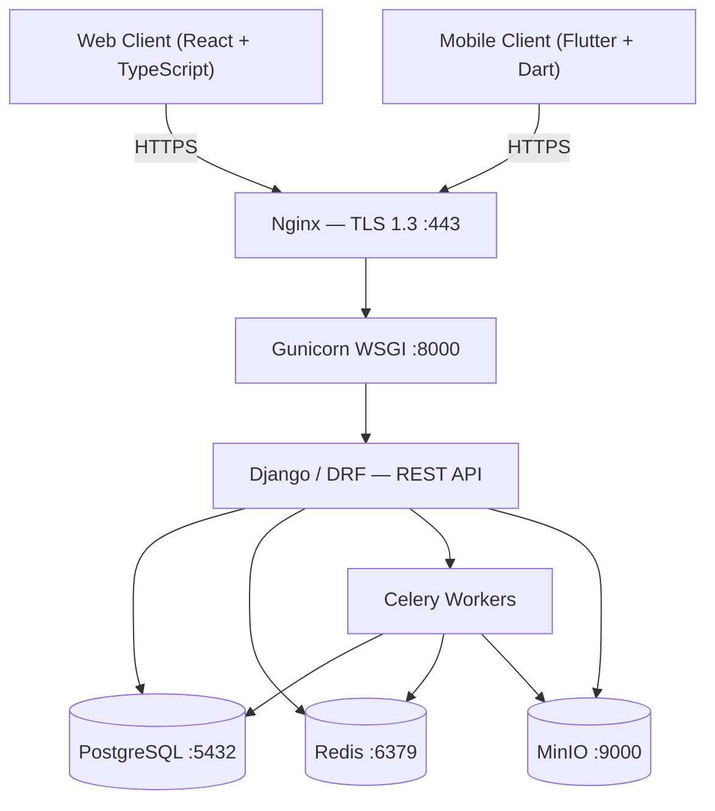
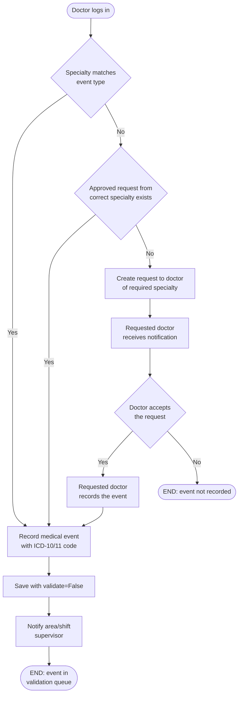
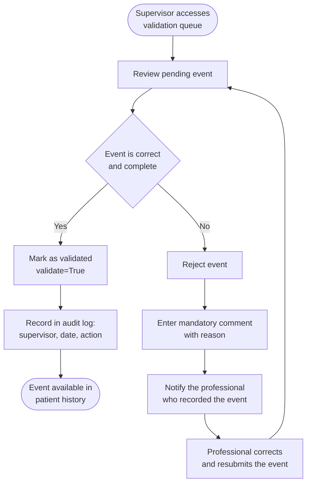
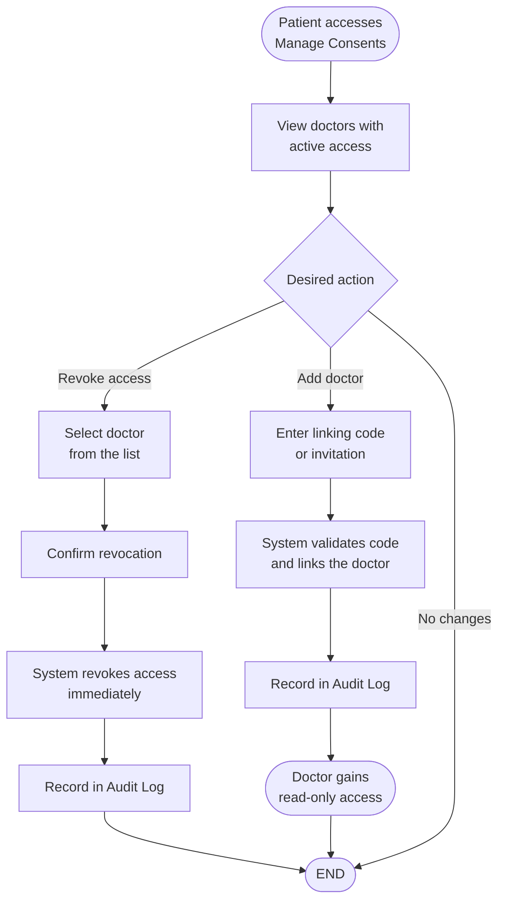
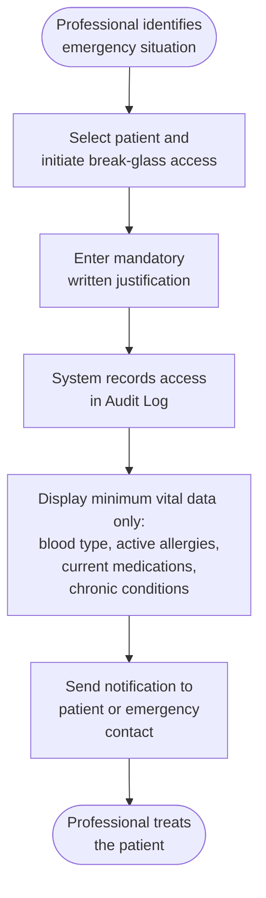
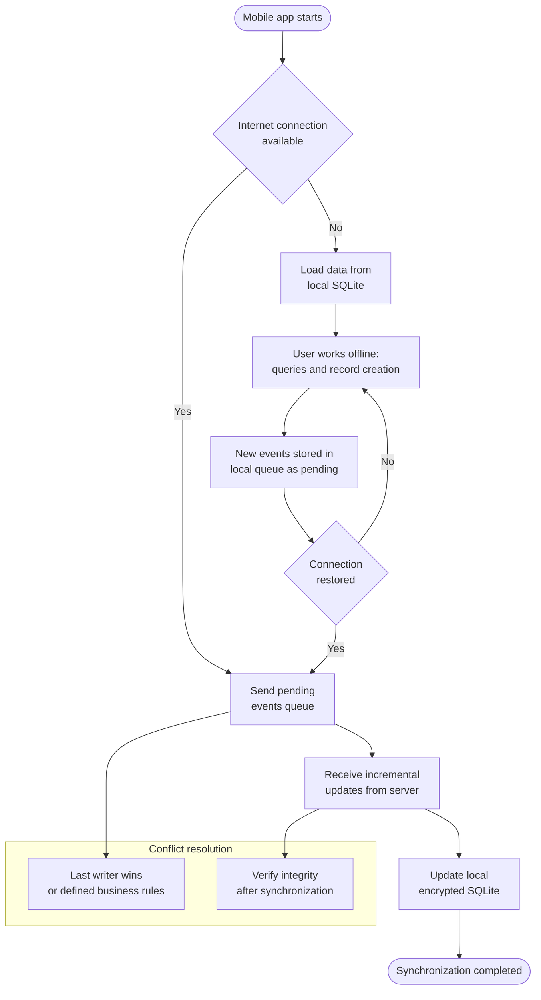
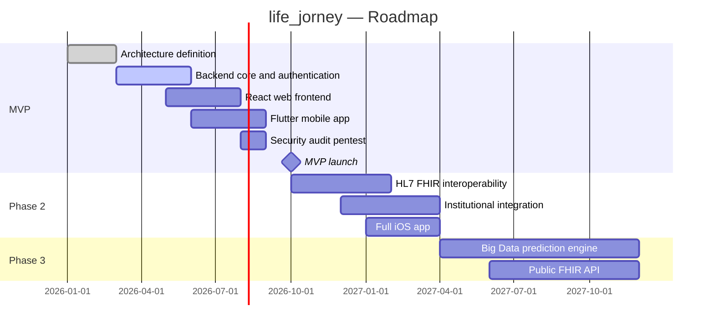

# SOFTWARE ENGINEERING — life_jorney

> Living document. Updated progressively as the product is defined.

---

## Table of Contents

1. [Product Vision](#1-product-vision)
2. [User Stories (US)](#2-user-stories-us)
3. [Functional Requirements (FR)](#3-functional-requirements-fr)
4. [Non-Functional Requirements (NFR)](#4-non-functional-requirements-nfr)
5. [Software Architecture](#5-software-architecture)
6. [Process Diagrams](#6-process-diagrams)
7. [Interface Design (UI)](#7-interface-design-ui)
8. [Design Patterns](#8-design-patterns)
9. [Interoperability and Clinical Standards](#9-interoperability-and-clinical-standards)
10. [Privacy by Design](#10-privacy-by-design)
11. [Sustainability Model](#11-sustainability-model)

---

## 1. Product Vision

life_jorney is the global, open-source, non-profit platform that consolidates, protects, and —in the future— analyzes the complete medical history of a person, from before birth to the end of life, with the goal of predicting diseases before they occur.

### 1.1 Purpose and problem

Today, a person's medical information is scattered across dozens of systems, hospitals, and formats. There is no single, secure, and universal place where patients and healthcare professionals can consult the complete clinical journey of an individual, including family history that would enable the study of hereditary patterns.

life_jorney solves this fragmentation and lays the groundwork for applying massive Big Data algorithms in later phases that calculate the probability of developing diseases such as cancer based on that data.

### 1.2 Target users

- **Patients:** people who want control and ownership over their unified medical history, and that of their immediate family members (parents, grandparents, etc.).
- **Healthcare professionals:** doctors, nurses, specialists, laboratory technicians, imaging professionals, and healthcare centers that need to consult or record clinical information securely, with appropriate consent.
- **Healthcare centers:** hospitals, clinics, and medical offices that wish to integrate their systems with life_jorney as a unified history repository.
- **Future (not in MVP):** researchers and AI systems whose purpose is to generate predictions of hereditary diseases using anonymized data.

### 1.2 Unique value proposition

- **Total consolidation:** a single repository with all of a patient's medical events —consultations, vaccines, diagnoses, treatments, prenatal reports— from before birth to the cause of death.
- **Security and privacy as a foundation:** the data is sensitive; protection, informed consent, privacy by design, and regulatory compliance (GDPR / HIPAA) are a fundamental pillar, not an afterthought.
- **Clinical interoperability:** data is stored and can be exported using international standards (HL7 FHIR R4, ICD-10/11, LOINC, SNOMED CT).
- **Controlled emergency access:** break-glass mechanism for critical situations where the patient cannot give consent, always audited and notified.
- **Disease prediction:** in later phases, a Big Data engine will analyze family patterns to anticipate hereditary risks, operating exclusively on anonymized data or with explicit consent for research.
- **Global reach:** available 24/7 from any location, accessible via web and mobile devices.

### 1.4 Initial scope (MVP)

**What is included:**
- Chronological log of all patient medical events (birth, consultations, vaccines, diagnoses, treatments).
- Management of known allergies and active medications, with interaction alerts.
- Family medical history records (parents, grandparents, other relatives).
- Differentiated access roles with secure authentication and two-factor verification.
- Traceability and control of who accesses the information (immutable audit log).
- Emergency access (break-glass) with automatic notification to the patient.
- Medical history export in HL7 FHIR R4 and PDF format.
- Right to erasure: permanent deletion of account and personal data.

**What is excluded from the first version:**
- The Big Data and disease prediction module.
- Advanced hereditary pattern analysis capabilities.
- Direct integration with hospital HIS/LIS systems via FHIR.

### 1.5 Usage context and platform

- **Availability:** any time of day, every day of the year.
- **Platforms:** Mobile (Android/iOS in Flutter/Dart), Web (React).
- **Backend/API:** Python/Django with Django Rest Framework (DRF).
- **Geographic scope:** global.

### 1.6 Meaning of the name

life_jorney symbolically represents the journey of the patient's life: a unique, irrepeatable path that deserves to be documented with dignity and precision. The graphic alteration of "journey" to "jorney" gives it its own identity, evoking the idea that each medical history is also a personal story.

### 1.7 Philosophy and community model

life_jorney was born as a non-profit open source project, driven by a deep conviction: as humanity, we invest and develop far more for war than for health. This project is a small act of rebellion against that reality.

We believe that a tool as essential as a unified medical history and early disease prediction must be a common good, not a commercial privilege. Therefore:

- All source code will be publicly available under a permissive open source license.
- Anyone —developers, doctors, designers, researchers— can contribute, audit, improve, and extend the platform.
- Project governance will foster transparent collaboration, collective decision-making, and respect for patient data as a human right.
- Healthcare institutions, universities, and NGOs are encouraged to join and enrich the ecosystem with their clinical and technical expertise.

**How to get involved:** If you share the vision that healthcare technology can save lives when shared freely, you are welcome. Whether your contribution is code, design, documentation, medical review, or outreach — every contribution brings this journey to more people.

---

## 2. User Stories (US)

| ID | Story | Acceptance Criteria | Priority |
|----|-------|---------------------|----------|
| US-01 | **Medical event registration by specialty** As a doctor, I want to record a medical event for a patient (consultation, diagnosis, vaccine, etc.), as long as it corresponds to my specialty, in order to build a complete and reliable clinical history. | - The system verifies that the doctor has the required specialty for the event type. - If it does not match, the system blocks registration unless an approved request from a doctor of the correct specialty exists (see US-02). - The event is saved with `validate=False` until a supervisor approves it. - Author, date, and time are automatically recorded. - The diagnosis must be coded with ICD-10/11. | Critical |
| US-02 | **Cross-specialty registration request** As a doctor, I want to request that another doctor from a different specialty records an event in a patient's history, to ensure that each piece of data is entered by the appropriate clinical professional. | - The doctor creates a request addressed to a doctor of the required specialty, indicating the patient and event type. - The requested doctor receives a notification and can accept or decline. - If accepted, the event is recorded and linked to both doctors (requester and executor). | High |
| US-03 | **Event validation by supervisor** As a supervisor (ward chief, shift leader, etc.), I want to review and validate pending medical events, to ensure that information in the database is verified (`validate=True`). | - The supervisor sees the list of pending events for their area/shift. - Can validate or reject with a mandatory comment in case of rejection. - A rejected event is returned to the professional for correction. - The system records who validated and when. | Critical |
| US-04 | **Patient consultation of medical history** As a patient, I want to consult my entire medical history in a chronological and filterable format, to have full knowledge of my health status. | - Read-only access to all validated events. - Chronological view with filters by event type, specialty, and date. - No write operations (create, modify, delete) available in this view. | Critical |
| US-05 | **Family medical history visualization** As a patient, I want to view the family medical history linked to my profile, to be aware of potential hereditary risks. | - List of linked relatives (parents, grandparents, etc.) with their shared relevant medical events. - Simplified graphical representation (SVG family tree) with indicators of known hereditary diseases. | Medium |
| US-06 | **User management and error reports** As an administrator, I want to manage users (registrations, deactivations, roles, passwords) and receive error reports, to maintain the correct functioning of the software. | - Panel with search and listing of all users. - Change roles, deactivate accounts, and reset credentials. - Error report inbox with statuses (pending, in progress, resolved) and notes. | High |
| US-07 | **Secure authentication with second factor** As a system user (any role), I want to authenticate securely with credentials and a second factor, to protect access to sensitive health data. | - Login with email and password. - Second factor (OTP or authenticator app) mandatory for roles doctor, supervisor, and admin. - Temporary lockout after 5 consecutive failed attempts. - Password recovery via verified email link, valid for 30 minutes. | Critical |
| US-08 | **History access consent management** As a patient, I want to grant or revoke my explicit consent for a specific doctor to access my history, to maintain control over who views my health data. | - List of doctors with active access. - Add a doctor using a unique linking code or invitation. - Revoke access at any time with immediate effect. - All actions are recorded in the audit log. - The patient receives a notification when a doctor accesses for the first time. | Critical |
| US-09 | **Supply administration record by nursing staff** As a nurse, I want to record vaccines, serums, and other supplies administered to a patient, to leave a precise record of what was received during their care. | - The system verifies that the nurse is authorized for this type of event. - The record includes supply type, batch number, date, time, and dose. - The event is saved with `validate=False` until a supervisor approves it. - Can only register supplies for assigned patients or those under their care area. | Critical |
| US-10 | **Laboratory results recording** As a laboratory technician, I want to enter and modify results of blood, stool, urine, and other tests, so that doctors and patients have updated and reliable diagnostic information. | - The system verifies that the technician is authorized for the exam type. - Can create or modify a result (with mandatory justification for modifications). - Each modification generates a change history visible to supervisors. - Results are linked to a prior medical order and coded with LOINC. - Remain with `validate=False` until the supervisor validates them. | Critical |
| US-11 | **Imaging study registration** As an imaging professional, I want to store and interpret results of X-rays, ultrasounds, and other imaging studies, so they are linked to the patient's history. | - The system verifies that the professional has the imaging specialty. - Allows uploading DICOM, JPEG, PNG files linked to the study. - Rich text field for the interpretation report. - The study remains with `validate=False` until the supervisor approves it. - Must be linked to a prior medical order. | Critical |
| US-12 | **Emergency access (break-glass)** As an on-call or emergency healthcare professional, I want to access the basic history of an incapacitated patient without prior consent, in order to make safe clinical decisions in life-threatening situations. | - Only available for roles doctor and supervisor with valid credentials. - The professional must enter a mandatory written justification for the emergency access. - The access is recorded in the audit log with full details. - The patient or their emergency contact receives an immediate notification. - Only minimum vital information is exposed: blood type, active allergies, current medications, and chronic conditions. | Critical |
| US-13 | **Allergy and active medication management** As a doctor (with patient consent), I want to record and keep updated the list of known allergies and medications the patient is currently taking, to prevent adverse reactions and medication errors. | - The doctor can add, modify, or mark as inactive an allergy or medication. - Medications are coded with the ATC code (WHO); allergies coded with SNOMED CT when available. - The system emits a clinical alert when a new supply or medication presents an interaction risk with an active medication or registered allergy. - The patient can view (read-only) their list of allergies and active medications. - All changes are recorded in the audit log. | Critical |
| US-14 | **Data portability and export** As a patient, I want to export my complete medical history in a standard interoperable format, so I can share it with another doctor or institution without depending on life_jorney. | - The patient can request export of their history in HL7 FHIR R4 (JSON) and human-readable PDF format. - The export is generated asynchronously and the patient receives a secure download link by email. - The download link expires in 48 hours. - The action is recorded in the audit log. | High |
| US-15 | **Account and data deletion (right to erasure)** As a patient, I want to request the permanent deletion of my account and all my personal data, exercising my right to erasure under GDPR Art. 17. | - The patient initiates the request from their account settings. - The system informs of the implications (irreversible, data unrecoverable). - Deletion requires confirmation with password and second factor. - The administrator has a maximum of 30 days to complete the deletion. - Minimum audit records (without personally identifiable data) are retained as legally required. - The patient receives email confirmation when deletion is complete. | High |

---

## 3. Functional Requirements (FR)

### 3.1 Authentication and Security

| ID | Description | US | Status |
|----|-------------|-----|--------|
| FR-01 | The system must allow user registration with the following roles: patient, doctor, nurse, laboratory technician, imaging professional, supervisor, and administrator. | US-07 | Defined |
| FR-02 | The system must require authentication with email and password for all roles. | US-07 | Defined |
| FR-03 | The system must require a second authentication factor (OTP or authenticator app) as mandatory for roles: doctor, nurse, laboratory technician, imaging professional, supervisor, and administrator. | US-07 | Defined |
| FR-04 | The system must temporarily lock an account after 5 consecutive failed login attempts. | US-07 | Defined |
| FR-05 | The system must allow password recovery via a link sent to the verified email address, valid for a maximum of 30 minutes. | US-07 | Defined |

### 3.2 Patient Management and Consent

| ID | Description | US | Status |
|----|-------------|-----|--------|
| FR-06 | The system must allow the patient to consult their medical history in read-only mode, with filters by event type, specialty, and date. | US-04 | Defined |
| FR-07 | The system must allow the patient to view linked family medical history, including a graphical family tree representation. | US-05 | Defined |
| FR-08 | The system must allow the patient to grant explicit consent to a specific doctor to access their history, via a unique linking code or invitation. | US-08 | Defined |
| FR-09 | The system must allow the patient to revoke a doctor's access consent at any time, with immediate effect. | US-08 | Defined |
| FR-10 | The system must record in an audit log all consent grant and revocation actions (who, when, and for whom). | US-08 | Defined |

### 3.3 Medical Event Recording (Doctors)

| ID | Description | US | Status |
|----|-------------|-----|--------|
| FR-11 | The system must verify that the doctor attempting to record a medical event holds the required specialty for that event type. | US-01 | Defined |
| FR-12 | The system must block event recording if the doctor's specialty does not match, unless an approved request from a doctor of the correct specialty exists. | US-01, US-02 | Defined |
| FR-13 | The system must store each medical event with an initial state of `validate=False` until a supervisor approves it. | US-01 | Defined |
| FR-14 | The system must automatically record the author, date, and time of creation for each medical event. | US-01 | Defined |
| FR-15 | The system must allow a doctor to create a registration request addressed to another doctor of a different specialty, specifying the patient and event type. | US-02 | Defined |
| FR-16 | The system must notify the requested doctor of the new pending registration request. | US-02 | Defined |
| FR-17 | The system must allow the requested doctor to accept or reject the request; if accepted, they record the event and it is linked to both doctors (requester and executor). | US-02 | Defined |

### 3.4 Supply Administration Records (Nursing)

| ID | Description | US | Status |
|----|-------------|-----|--------|
| FR-18 | The system must verify that the user holds the nurse role before allowing supply records. | US-09 | Defined |
| FR-19 | The system must allow the nurse to record supply type, batch number, date, time, and administered dose. | US-09 | Defined |
| FR-20 | The system must restrict supply records to patients assigned to the nurse or under their care area. | US-09 | Defined |
| FR-21 | The system must store the supply record with state `validate=False` until a supervisor validates it. | US-09 | Defined |

### 3.5 Laboratory Results Recording

| ID | Description | US | Status |
|----|-------------|-----|--------|
| FR-22 | The system must verify that the user holds the laboratory technician role and is authorized for the exam type. | US-10 | Defined |
| FR-23 | The system must allow the technician to create or modify a result (with mandatory justification for modifications). | US-10 | Defined |
| FR-24 | The system must maintain a change history for each result modification, visible to supervisors. | US-10 | Defined |
| FR-25 | The system must require that every laboratory result be associated with a prior medical order issued by a doctor. | US-10 | Defined |
| FR-26 | The system must store results with state `validate=False` until a supervisor of the area validates them. | US-10 | Defined |

### 3.6 Imaging Study Registration

| ID | Description | US | Status |
|----|-------------|-----|--------|
| FR-27 | The system must verify that the user holds the imaging specialty before allowing imaging study records. | US-11 | Defined |
| FR-28 | The system must allow uploading image files in standard formats (DICOM, JPEG, PNG, etc.) linked to the study. | US-11 | Defined |
| FR-29 | The system must provide a rich text field for the professional to write the study report or interpretation. | US-11 | Defined |
| FR-30 | The system must require that the imaging study be associated with a prior medical order issued by a doctor. | US-11 | Defined |
| FR-31 | The system must store the study with state `validate=False` until a supervisor approves it. | US-11 | Defined |

### 3.7 Supervisor Validation

| ID | Description | US | Status |
|----|-------------|-----|--------|
| FR-32 | The system must show the supervisor a list of all events pending validation for their area or shift. | US-03 | Defined |
| FR-33 | The system must allow the supervisor to mark an event as validated (`validate=True`), automatically recording their identity and the date. | US-03 | Defined |
| FR-34 | The system must allow the supervisor to reject an event, requiring a mandatory comment explaining the reason for rejection. | US-03 | Defined |
| FR-35 | When an event is rejected, the system must return it to the professional who recorded it for correction and possible resubmission. | US-03 | Defined |
| FR-36 | The system must record in an audit log who validated or rejected each event and on what date. | US-03 | Defined |

### 3.8 User Management and Administration

| ID | Description | US | Status |
|----|-------------|-----|--------|
| FR-37 | The system must provide the administrator with a panel for searching and listing all registered users. | US-06 | Defined |
| FR-38 | The system must allow the administrator to change roles, deactivate accounts, and reset credentials. | US-06 | Defined |
| FR-39 | The system must include an error report inbox with statuses (pending, in progress, resolved) and notes. | US-06 | Defined |

### 3.9 Audit and Traceability

| ID | Description | US | Status |
|----|-------------|-----|--------|
| FR-40 | The system must record all write operations in audit logs: who performed the action, what action, on what entity, and the exact date. | US-01, US-03, US-08–US-11 | Defined |
| FR-41 | The system must guarantee that audit logs cannot be modified or deleted by any role, including the administrator. | All write US | Defined |

### 3.10 Emergency Access

| ID | Description | US | Status |
|----|-------------|-----|--------|
| FR-42 | The system must provide a break-glass mechanism that allows a doctor or supervisor with valid credentials to access the minimum vital data of an incapacitated patient, with prior written justification. | US-12 | Defined |
| FR-43 | Break-glass access must be recorded with full details (professional, date, reason, data accessed) and automatically notified to the patient or their emergency contact. | US-12 | Defined |
| FR-44 | In break-glass mode the system must only expose: blood type, active critical allergies, current medications, and chronic conditions. The full history remains inaccessible without consent. | US-12 | Defined |

### 3.11 Allergy and Medication Management

| ID | Description | US | Status |
|----|-------------|-----|--------|
| FR-45 | The system must allow authorized doctors to record and update the list of known allergies and active medications of a patient. | US-13 | Defined |
| FR-46 | The system must emit a clinical alert when a supply or medication is registered that presents an interaction risk with an active medication or registered allergy of the patient. | US-13 | Defined |
| FR-47 | Medications must be coded with the ATC code (WHO); allergies must be codeable with SNOMED CT when the term is available. | US-13 | Defined |

### 3.12 Data Portability and Deletion

| ID | Description | US | Status |
|----|-------------|-----|--------|
| FR-48 | The system must allow the patient to request and download their complete medical history in HL7 FHIR R4 (JSON) and structured PDF format. | US-14 | Defined |
| FR-49 | The export must be generated asynchronously and the patient must receive a secure download link with a 48-hour expiration. | US-14 | Defined |
| FR-50 | The system must allow the patient to initiate a permanent account and personal data deletion request, confirmed with password and second factor. | US-15 | Defined |
| FR-51 | The administrator must have a workflow to complete the deletion within a maximum of 30 days, retaining only the minimum audit records required by law, without personally identifiable data. | US-15 | Defined |

---

## 4. Non-Functional Requirements (NFR)

### 4.1 Performance

| ID | Category | Description | Metric |
|----|----------|-------------|--------|
| NFR-01 | Performance | The system must respond to medical event queries in less than 1 second for 95% of requests, under a load of up to 500 concurrent users. | Response time < 1 s at p95; maximum concurrent load: 500 users. |
| NFR-02 | Performance | Image file uploads (DICOM, JPEG, PNG) must support automatic resumption after interruptions, without restarting from the beginning. | Resumable upload (tus.io or chunked uploads); progress indicator; pause/resume available to the user. |

### 4.2 Resilience and limited connectivity

| ID | Category | Description | Metric |
|----|----------|-------------|--------|
| NFR-03 | Resilience | The mobile app must work with minimum bandwidth (2G/3G networks) and high latency, maintaining usability for critical operations. | History view load (text only) ≤ 5 s on simulated 2G; basic functionality without images at < 200 ms latency. |
| NFR-04 | Resilience | Heavy file uploads must notify the user of the estimated duration on slow connections and offer the option to upload in the background with automatic resumption. | Automatic retries with exponential backoff; status notifications (pending, in progress, completed, failed). |
| NFR-05 | Resilience | The platform must maintain a functional connection with the server using lightweight protocols (WebSocket with automatic reconnection). | Incremental synchronization with payloads < 10 KB per burst; heartbeat every 30 s to detect drops. |
| NFR-06 | Resilience | During prolonged connectivity outages, the mobile app must preserve unsent data in local encrypted storage and sync when connection is restored. | AES-256 encrypted SQLite; persistent synchronization queue; integrity verification after synchronization. |

### 4.3 Security

| ID | Category | Description | Metric |
|----|----------|-------------|--------|
| NFR-07 | Security | All communication between client and server must be encrypted via TLS 1.3, without allowing earlier protocol versions. | TLS 1.3 enabled; efficient cipher suites (ChaCha20-Poly1305); automated validation in CI. |
| NFR-08 | Security | Stored health data must be encrypted at rest with AES-256. Sensitive fields (diagnoses, medical notes) must be encrypted at the column level in the database and at the field level in local SQLite. | AES-256 at rest; column-level encryption with pgcrypto; SQLite encrypted with SQLCipher. |
| NFR-09 | Security | The system must comply with GDPR (European citizens), HIPAA (US health information), and equivalent local regulations. It must support remote deletion of local device data in case of loss or theft. | Compliance audit before launch; privacy policies documented; remote deletion available to administrator or patient. |
| NFR-10 | Security | Passwords must be stored with robust hash algorithms (bcrypt or Argon2). Authentication tokens must have a maximum expiration of 1 hour for healthcare roles and 24 hours for patients. | Hash: bcrypt or Argon2; expiration ≤ 1 h (healthcare staff), ≤ 24 h (patients). |
| NFR-23 | Security | The system must undergo at least one external security audit (penetration test) before each major release. Critical and high findings must be resolved before production deployment. | Third-party pentest report; critical/high findings = 0 in production; medium findings with documented mitigation plan. |
| NFR-24 | Security | The project must produce and maintain a Data Protection Impact Assessment (DPIA) in accordance with GDPR Art. 35, reviewed upon every significant change in architecture or data processing. | DPIA documented in `docs/privacy/dpia.md`; reviewed annually or upon major changes. |

### 4.4 Scalability

| ID | Category | Description | Metric |
|----|----------|-------------|--------|
| NFR-11 | Scalability | The backend must be able to scale horizontally by adding instances without modifying the code. | Capacity for 5 backend instances in MVP; linear performance demonstrated up to 2,000 concurrent users. |
| NFR-12 | Scalability | The database must support read replicas to distribute frequently accessed history queries. | At least 1 configurable read replica in production. |

### 4.5 Availability and recovery

| ID | Category | Description | Metric |
|----|----------|-------------|--------|
| NFR-13 | Availability | The platform must have 99.5% monthly availability (excluding scheduled maintenance). | Availability ≥ 99.5%; internal SLA documented. |
| NFR-14 | Availability | In case of failure of a critical component, the system must automatically recover in less than 5 minutes. | RTO < 5 minutes. |
| NFR-15 | Availability | The mobile app must be functional in offline mode for queries and record creation, syncing them when connection is restored. | Full offline mode for reading and event creation; synchronization queue with automatic conflict resolution; airplane mode tests. |

### 4.6 Usability and accessibility

| ID | Category | Description | Metric |
|----|----------|-------------|--------|
| NFR-16 | Usability | The web interface must comply with WCAG 2.1 Level AA. | Score ≥ 90% in axe-core / Lighthouse; manual tests with screen readers. |
| NFR-17 | Usability | The mobile app must be usable on devices with screens of 4.7 inches and above, and allow adjustable text size. | Tests on emulators with different screen sizes; scalable fonts supported. |
| NFR-25 | Usability | The interface must support at least Spanish and English, with an i18n system extensible to other languages by the community. | i18n implemented with strings separated from code; Spanish and English complete in MVP. |

### 4.7 Energy efficiency

| ID | Category | Description | Metric |
|----|----------|-------------|--------|
| NFR-18 | Battery | The mobile app must implement battery-saving policies: < 20% battery → manual sync or Wi-Fi only; < 5% → pause all background operations. | Measured with Battery Historian (Android) and Xcode Energy Organizer (iOS). |
| NFR-19 | Battery | Images must be loaded progressively and lazily (lazy loading). | Images loaded only when entering the viewport; use of WebP/AVIF with adaptive compression. |

### 4.8 Maintainability

| ID | Category | Description | Metric |
|----|----------|-------------|--------|
| NFR-20 | Maintainability | Source code must maintain unit and integration test coverage above 80%. | Coverage ≥ 80% globally; verified on every pull request. |
| NFR-21 | Maintainability | All code must be documented in English, with docstrings for every module, class, and public function (PEP 257 for Python, JSDoc for JavaScript). | Automatic generation with Sphinx / Storybook; no public function without a docstring. |
| NFR-22 | Maintainability | The project must adopt a Git workflow with feature branches and semantic commits (Conventional Commits). | Format `type(scope): description`; commit linting in CI. |

### 4.9 Data privacy

| ID | Category | Description | Metric |
|----|----------|-------------|--------|
| NFR-26 | Privacy | The system must support data residency configuration, allowing organizations to specify the geographic region where their patients' data is stored. | Per-organization storage region configuration; data not replicated outside the configured region. |
| NFR-27 | Privacy | Data used for analysis or research (post-MVP phase) must be anonymized before any use, applying k-anonymity or differential privacy, making it impossible to re-identify any individual. | Anonymization validation before exporting research datasets; coefficient k ≥ 5 for k-anonymity. |

---

## 5. Software Architecture

### 5.1 Architectural style

**Style:** Modular monolith with RESTful APIs and offline-first support on the mobile client.

The backend is structured as a single Django project, organized into independent applications by functional domain. This approach allows:

- Fast initial development and transactional consistency for health data that requires strict referential integrity.
- Horizontal scalability of the monolith by adding instances behind a load balancer, without premature microservices.
- Preparation for an eventual extraction of modules into independent services as growth justifies it (strangler fig pattern).

Communication with clients (React, Flutter) takes place through a unified REST API built with DRF. To support offline functionality (NFR-15), the mobile client implements a local persistence layer (encrypted SQLite) and bidirectional synchronization with conflict resolution.

### 5.2 Technology stack

| Layer | Technology | Rationale |
|-------|-----------|-----------|
| Backend / API | Python 3.12 + Django 5.0 + DRF | Robust, mature, and widely adopted open source ecosystem. DRF facilitates self-documented RESTful APIs with OpenAPI. Large community favorable to contributions. |
| Web Frontend | React 18 + TypeScript | Widely adopted, rich ecosystem, reactive and accessible interfaces (WCAG 2.1 AA). TypeScript adds static typing for better maintainability. |
| Mobile Frontend | Flutter 3 + Dart | Cross-platform (Android and iOS) with native performance. Robust support for SQLite, file storage, and background operations, essential for offline features. |
| Main database | PostgreSQL 16 | Open source relational engine supporting column-level encryption (pgcrypto), read replicas, advanced indexes for clinical searches, and native audit via triggers. |
| Local mobile database | SQLite + SQLCipher | AES-256 encrypted local persistence for offline mode. Lightweight and available on all mobile devices. |
| File storage | MinIO (self-hosted S3-compatible) | Open source alternative to Amazon S3 with encryption at rest, lifecycle policies, and full data control, aligned with the project's philosophy. |
| Cache and sessions | Redis 7 | In-memory storage for sessions, query cache, tokens, and message broker for Celery. |
| Async task queue | Celery + Redis | Background task management: file uploads, FHIR/PDF export generation, email notifications. |
| Web server / Reverse proxy | Nginx + Gunicorn | Nginx handles TLS 1.3 termination, static files, and reverse proxy to Gunicorn. Lightweight and battle-tested in production. |
| Containers | Docker + Docker Compose (dev), Kubernetes (future production) | Docker ensures reproducible environments. Kubernetes for horizontal scaling when demand requires it. |
| Clinical standards | HL7 FHIR R4, ICD-10/11, LOINC, SNOMED CT, ATC | International standard clinical interoperability and coding. See Section 9. |

### 5.3 Component diagram

**Django applications (apps):**

| App | Responsibility | Related US / FR |
|-----|----------------|-----------------|
| `core` | Base configuration, audit middleware, common helpers | Cross-cutting |
| `usuarios` | Authentication, roles, permissions, 2FA | US-07, FR-01–FR-05 |
| `pacientes` | Profiles, family links, consents | US-04, US-05, US-08, FR-06–FR-10 |
| `eventos_medicos` | Event recording, cross-specialty requests | US-01, US-02, FR-11–FR-17 |
| `alergias_medicamentos` | Allergies, active medications, clinical alerts | US-13, FR-45–FR-47 |
| `enfermeria` | Supply administration records | US-09, FR-18–FR-21 |
| `laboratorio` | Exam results, medical orders | US-10, FR-22–FR-26 |
| `imaginologia` | Imaging studies, DICOM file uploads | US-11, FR-27–FR-31 |
| `validacion` | Supervisor validation queue | US-03, FR-32–FR-36 |
| `emergencia` | Break-glass access, emergency notifications | US-12, FR-42–FR-44 |
| `administracion` | Admin panel, user management, error reports | US-06, FR-37–FR-39 |
| `auditoria` | Immutable logs of all write operations | FR-40, FR-41 |
| `exportacion` | HL7 FHIR and PDF export generation | US-14, FR-48, FR-49 |
| `sincronizacion` | Endpoints and logic for mobile offline synchronization | NFR-15 |

### 5.4 Data model (main entities)

- **User** (`id`, `email`, `password_hash`, `role`, `is_active`, `created_at`)
- **Patient** (`user_id` FK, `date_of_birth`, `blood_type`, `address`, `phone`, `emergency_contact_name`, `emergency_contact_phone`)
- **Doctor** (`user_id` FK, `specialty_id` FK, `license_number`)
- **Specialty** (`id`, `name`, `description`)
- **Nurse** (`user_id` FK, `assigned_area`)
- **LaboratoryTechnician** (`user_id` FK, `authorized_exam_types[]`)
- **ImagingProfessional** (`user_id` FK, `authorized_study_types[]`)
- **Supervisor** (`user_id` FK, `supervised_area`, `shift`)
- **Allergy** (`id`, `patient_id` FK, `substance`, `snomed_code`, `severity`, `is_active`, `recorded_by` FK Doctor, `recorded_at`)
- **ActiveMedication** (`id`, `patient_id` FK, `name`, `atc_code`, `dose`, `frequency`, `start_date`, `end_date`, `prescribed_by` FK Doctor)
- **MedicalEvent** (`id`, `patient_id` FK, `event_type`, `description`, `icd_code`, `event_date`, `author_id` FK Doctor, `specialty_id` FK, `validate`, `supervisor_id` FK, `validated_at`)
- **RegistrationRequest** (`id`, `requesting_doctor_id` FK, `executing_doctor_id` FK, `patient_id` FK, `event_type`, `status`)
- **Supply** (`id`, `patient_id` FK, `nurse_id` FK, `type`, `batch`, `dose`, `administered_at`, `validate`, `supervisor_id` FK)
- **MedicalOrder** (`id`, `requesting_doctor_id` FK, `patient_id` FK, `order_type`, `description`, `date`)
- **LaboratoryResult** (`id`, `patient_id` FK, `technician_id` FK, `exam_type`, `loinc_code`, `result`, `attachment`, `medical_order_id` FK, `validate`, `supervisor_id` FK)
- **ImagingStudy** (`id`, `patient_id` FK, `imaging_professional_id` FK, `study_type`, `files[]`, `report`, `medical_order_id` FK, `validate`, `supervisor_id` FK)
- **Consent** (`id`, `patient_id` FK, `doctor_id` FK, `status`, `granted_at`, `revoked_at`)
- **EmergencyAccess** (`id`, `professional_id` FK, `patient_id` FK, `justification`, `accessed_data`, `accessed_at`, `notification_sent`)
- **FamilyLink** (`id`, `patient_id` FK, `relative_patient_id` FK, `relationship`)
- **AuditLog** (`id`, `user_id` FK, `action`, `affected_entity`, `entity_id`, `timestamp`, `detail_json`) — write-only; no modification or deletion permissions for any role.

> Healthcare professionals are modeled as profile records with FK to User (not multi-table inheritance), to maintain simplicity and clarity in audit queries.

### 5.5 Backup and data recovery strategy

**Objective:** Guarantee the integrity and availability of clinical information against hardware failures, human errors, or disasters.

**Mechanisms:**

- **Database backups:** `pg_dump` + WAL-G for PostgreSQL. Full daily backup (during low-activity window) + incremental WAL backups every 15 minutes. Retention: 30 days full, 7 days WAL. Storage in a separate MinIO bucket or secondary encrypted server in a geographically distinct location.
- **Image and laboratory file backups:** MinIO with object versioning and replication to a second MinIO cluster. Continuous synchronization with maximum 1-hour delay.
- **Configuration and secrets backup:** private Git repository with restricted access.

**Recovery procedure:** documented in `docs/operations/recovery.md`.
- RTO target: < 30 minutes (database), < 1 hour (files).
- Maximum RPO: 15 minutes of transaction loss (thanks to incremental WAL).

**Drills:** A full recovery drill is a prerequisite for every major release.

---

## 6. Process Diagrams

### 6.1 Medical Event Registration Flow (Doctors)

**Related US:** US-01, US-02 | **Related FR:** FR-11–FR-17

### 6.2 Supervisor Validation Flow

**Related US:** US-03 | **Related FR:** FR-32–FR-36

### 6.3 History Access Consent Flow

**Related US:** US-08 | **Related FR:** FR-08, FR-09, FR-10

### 6.4 Emergency Access Flow (Break-Glass)

**Related US:** US-12 | **Related FR:** FR-42–FR-44

### 6.5 Offline Synchronization Flow (Mobile)

**Related NFR:** NFR-03, NFR-04, NFR-06, NFR-15

---

## 7. Interface Design (UI)

### 7.1 Login and Authentication (Login / 2FA)

**Purpose:** Allow all users to securely access the system with credentials and, depending on the role, complete the second authentication factor.

**Components:**
- Email and password fields (with visibility toggle).
- "Sign in" button and "Forgot your password?" link.
- For healthcare/admin roles: intermediate screen to enter OTP code (email or authenticator app).
- Failed attempts indicator and temporary lockout message after 5 errors.

**Data:** Input: email, password, OTP code (if applicable). Output: session token, redirect to the role's panel.

**Navigation:** Public route → Login → Role panel. Recover password → link-to-email flow.

---

### 7.2 Patient Panel: Medical History and Family

**Purpose:** Chronological and filterable view of medical history, allergies, active medications, and family history.

**Components:**
- Vertical timeline with event cards (date, type, doctor, brief description).
- Filters: event type, specialty, date range.
- Side panel: active allergies and current medications highlighted for quick access.
- "Family history" tab with SVG family tree.
- "Export history" button (PDF or FHIR JSON).
- Access to "Manage consents" from the side menu.

**Data:** Input: filter parameters. Output: validated events (read-only), active allergies and medications, linked relatives.

**Navigation:** Event card → full detail (diagnosis, ICD code, attachments). Side menu → Consents, Export data, Profile, Sign out.

---

### 7.3 Doctor Panel: Medical Event Registration

**Purpose:** Register a new event for a patient, verifying specialty, consent, and clinical safety alerts.

**Components:**
- Patient selector/search (with active consent verification).
- Event type selector (limited to the doctor's specialty).
- Dynamic form: description, date, ICD-10/11 code, notes, attachments.
- Clinical alerts panel: patient's active allergies and medications with possible interactions.
- Visual indicator if the event requires a request to another specialty.
- "Submit for validation" button (saves with `validate=False`).

**Data:** Input: clinical data, ICD code, optional files. Output: registration confirmation, event in validation queue.

**Navigation:** If specialty does not match → "Request specialist" option (US-02). "Requests" section → history of sent/received requests.

---

### 7.4 Supervisor Panel: Event Validation

**Purpose:** Queue of pending events for the area/shift with tools to approve or reject.

**Components:**
- Paginated list: type, patient, author, date, status.
- Event detail view. "Validate" and "Reject" buttons.
- On reject: mandatory text field for reason.
- Pending event counter in the header.

**Data:** Input: date or professional filters (optional). Output: validation/rejection record, queue update.

**Navigation:** On validate/reject, the event disappears from the queue. Access to validation history (audit log).

---

### 7.5 Administrator Panel: User Management and Reports

**Purpose:** Search users, modify roles, deactivate accounts, manage error reports, and handle data deletion requests.

**Components:**
- User table with search by email, role, status.
- Actions: change role, deactivate, reset password.
- "Error reports" tab with status and notes.
- Data deletion requests panel (right to erasure) with visible legal deadline.

**Data:** Input: search criteria. Output: action confirmation, real-time update.

---

## 8. Design Patterns

| Pattern | Category | Where applied | Why |
|---------|----------|---------------|-----|
| MVC / MTV | Architectural | Django backend (Models, Views, DRF Serializers as presentation layer). | Django follows MTV, which facilitates separation of concerns, maintainability, and testing (NFR-20, NFR-21). |
| Repository | Persistence | Apps `eventos_medicos`, `laboratorio`, `imaginologia`, via managers and domain services that abstract complex queries. | Centralizes data access logic; allows changing the source (e.g., cache) without affecting business logic; facilitates unit tests. |
| Observer / Django Signals | Behavioral | Event creation → notify supervisor; consent granted → audit log; break-glass access → notify patient. | Decouples the emitter from subscribers (audit, notifications) using `django.dispatch.Signal`. |
| Strategy | Behavioral | Event validation by event type/specialty; conflict resolution in offline sync; export generation (PDF vs FHIR). | Encapsulates different algorithms selectable at runtime; makes it easy to add new rules without modifying existing ones. |
| Command | Behavioral | Audit logging: each write action translates into a command object stored as `AuditLog`. | Decouples request from execution; enables an immutable history of all operations (FR-40, FR-41). |
| Factory Method | Creational | Creation of user profiles by role (patient, doctor, nurse, etc.) in the `usuarios` app. | Simplifies instantiation of different profile models, ensuring correct configuration of role-specific fields. |
| Singleton (limited) | Creational | Redis connection; global configuration during Django's lifecycle (implemented implicitly via Django `settings`). | Ensures a single instance of expensive resources. |
| Decorator / Middleware | Structural | Authentication, role and permission checks (`permission_classes` in DRF); audit middleware; clinical alert middleware. | Adds cross-cutting concerns (security, logging, alerts) dynamically without modifying views, adhering to the open/closed principle. |
| Chain of Responsibility | Behavioral | Medical event validation pipeline: role check → specialty check → consent check → clinical alert check → registration. | Allows chaining security and validation checks flexibly, adding new verifications without modifying the registration core. |

---

## 9. Interoperability and Clinical Standards

Adopting international standards is fundamental for life_jorney to be globally adopted, integrated with existing systems, and for its data to remain clinically readable in the long term.

### 9.1 Clinical coding standards

| Standard | Scope of use | Application in life_jorney |
|----------|--------------|---------------------------|
| **ICD-10 / ICD-11** (WHO) | Diagnosis and disease coding | Mandatory in `icd_code` field of `MedicalEvent`. ICD-11 as the long-term target. |
| **LOINC** | Laboratory results and clinical observations | Mandatory in `loinc_code` field of `LaboratoryResult`. |
| **SNOMED CT** | Clinical terminology (findings, procedures, allergies) | Recommended for allergy coding (`snomed_code` in `Allergy`) and clinical procedures. |
| **ATC** (WHO) | Medication classification | Mandatory in `atc_code` field of `ActiveMedication`. |
| **DICOM** | Medical imaging (X-rays, CT, MRI, etc.) | Native format supported for image study uploads in the `imaginologia` app. |

### 9.2 HL7 FHIR R4

HL7 FHIR (Fast Healthcare Interoperability Resources) is the global standard for clinical information exchange. life_jorney adopts FHIR R4 as its export and interoperability format:

- **History export:** the `exportacion` module generates a FHIR `Bundle` package including the resources `Patient`, `Condition`, `MedicationStatement`, `AllergyIntolerance`, `Observation`, `DiagnosticReport`, `ImagingStudy`, and `Immunization`.
- **Validation:** exported FHIR resources must pass validation using the official HL7 validator.
- **Integration roadmap:** in post-MVP phases, native FHIR endpoints are planned to allow hospitals and clinics to integrate their HIS/LIS systems directly with life_jorney.

### 9.3 Future interoperability (post-MVP)

- Integration with hospital clinical information systems (HIS) via FHIR.
- Integration with laboratory information systems (LIS) for automatic result reception.
- Public API documented with OpenAPI 3.0 for authorized third-party integrations.

---

## 10. Privacy by Design

The privacy of health data is not an additional requirement but the central axis of life_jorney's design. The **7 Privacy by Design principles** by Ann Cavoukian are adopted, applied to the clinical context:

| Principle | Application in life_jorney |
|-----------|--------------------------|
| **1. Proactive, not reactive** | Privacy risks are identified and mitigated at the design phase (mandatory DPIA, NFR-24), before writing any code. |
| **2. Privacy as the default** | The minimum of data is collected and accessed by default. Doctors only see events for which they have consent. Break-glass access exposes the minimum vital data. |
| **3. Privacy embedded into design** | AES-256 encryption, immutable audit logs, and the explicit consent model are built into the architecture, not bolted on later. |
| **4. Full functionality — positive sum** | Security and usability are not mutually exclusive. The encrypted offline mode (NFR-06) guarantees both availability and data protection in limited environments. |
| **5. End-to-end security** | TLS 1.3 in transit (NFR-07), AES-256 at rest (NFR-08), column-level encryption in the database, and SQLCipher on mobile devices. |
| **6. Visibility and transparency** | The patient can see at all times who accesses their history, audit the consent log, and download their complete history in a standard format (US-14). |
| **7. Respect for user privacy** | The patient is the sovereign owner of their data: they can grant and revoke consents, export their information, and request permanent deletion (US-15). |

### 10.1 Digital informed consent

- Consent is granted explicitly (not opt-out), per doctor and per specific purpose.
- The complete history of granted and revoked consents is preserved, with exact timestamps.
- For minors or incapacitated individuals, consent is granted by the designated legal representative, which is documented.

### 10.2 Data minimization

- Each role accesses only the data necessary for their function (principle of least privilege).
- Break-glass access exposes only the minimum vital data.
- Audit logs will be anonymized before any use for research or analysis (NFR-27).

### 10.3 Applicable regulations

| Regulation | Geographic scope | Key requirements covered |
|------------|-----------------|--------------------------|
| **GDPR** | European Union | Explicit consent, right of access, data portability (US-14), right to erasure (US-15), breach notification within 72 h, DPIA (NFR-24). |
| **HIPAA** | United States | PHI encryption, access controls, audit logs, Business Associate Agreements (BAA) with infrastructure providers. |
| **Law 1581 of 2012** | Colombia | Prior and explicit authorization for processing sensitive data (health data). |
| **LGPD** | Brazil | Explicit consent, data subject rights, Data Protection Officer (DPO). |

> life_jorney must designate a Data Protection Officer (DPO) from the early stages of public deployment, in compliance with GDPR and LGPD requirements.

### 10.4 Security incident response plan

In the event of a data breach, the operations team must:

1. **Containment** (< 1 hour): isolate the affected component, revoke compromised tokens.
2. **Assessment** (< 4 hours): determine the scope, what data was exposed, and how many patients were affected.
3. **Notification** (< 72 hours for GDPR): notify the competent data protection authority and, where applicable, the affected patients.
4. **Remediation**: fix the vulnerability, restore from backup if necessary.
5. **Post-mortem**: document the incident, root causes, and lessons learned in `docs/incidents/`.

---

## 11. Sustainability Model

life_jorney is a non-profit project, but it requires a solid sustainability model to ensure its continuity, quality, and growth.

### 11.1 Funding strategy

| Source | Description | Horizon |
|--------|-------------|---------|
| **Individual donations** | Recurring donation platform (Open Collective, GitHub Sponsors). The community can support the project directly. | From MVP |
| **Grants and subsidies** | Applications to public health and open source funding programs (Mozilla Foundation, PAHO/WHO, digital health funds). | From MVP |
| **Institutional partnerships** | Public hospitals, universities, and health NGOs as institutional partners, contributing technical, medical, or financial resources in exchange for governance participation. | Phase 2 |
| **Managed support services** | For institutions preferring a managed life_jorney instance (hosting, support, guaranteed SLAs), a paid service that funds the project. The code remains open source. | Phase 2 |
| **Ethical medical research** | In advanced phases, anonymized datasets (with explicit patient consent) may be shared with researchers under strict ethical conditions. | Phase 3 (post-MVP) |

### 11.2 Project governance

- **Technical committee:** decisions on architecture, standards, and technology roadmap.
- **Medical-ethical committee:** healthcare professionals and bioethics experts who oversee that features respect clinical and ethical principles.
- **Privacy committee:** regulatory compliance, DPIA review, and security incident management.
- **Contributor community:** everyone who contributes to the project has a voice in decisions via a public RFC (Request for Comments) process.

### 11.3 High-level roadmap

---

*Last updated: 2026-05-09*
